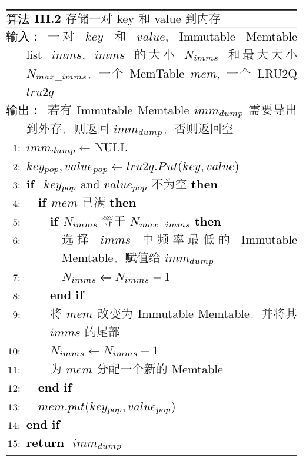

# FSLSM-Tree

## Overview

major contribution：

1. 重新设计了内存的存储结构；
2. 增加了数据上浮的操作；
3. 可以改变LSMTree的形状

## 整体结构

【图1：整体架构】

### 内存：LRU+FIFO替换

如图1中的Memory部分，在内存中的存储结构，我们用LRU+FIFO替换原来的MemTable+Immutable MemTable组合，它们两个的大小相同。

每当有数据从LRU中淘汰后会被加入FIFO。当新数据加入FIFO时，若FIFO已经满了，则将FIFO中的数据DUMP到外部设备，清空FIFO，新数据加入FIFO。当数据在LRU或FIFO中被访问，则都将该数据移动到LRU的头部。

### 外存：上浮和变形

如图1中的Disk/Flash部分，当一个文件被频繁访问时，我们将其上浮到高层。

如图1（a）和（b），当$L_6$层中的一个文件$SST_8$被访问后，通过计算得出将其移动到$L_1$层。为了去除$SST_8$中的旧数据，并不引起键值范围重叠，首先依次将$L_i(2\le i \le 5)$层中的有键值范围重叠的文件读进内存，删去$SST_8$中与它们重复的数据。

如图1（c）和（d），在$L_1$层，$SST_3$与去除重复数据后的$SST_8$存在键值范围重叠，将它们都读入内存，通过合并操作，划分为新的$SST_{10}$和$SST_{11}$，再将它们插入$L_1$层。上浮完成后，增加$L_1$层的最大文件个数。

#### 1. 确定需要上浮的数据

在外部存储设备中，数据从高层到低层是按照新旧度依次递减的，$L_0$层的数据最新， $L_6$层的数据最旧。根据LevelDB的查找机制来看，查找一个存在于$L_6$层的SSTable比查找一个存在于$L_0$层的SSTable，可能会产生更多的IO读，消耗更多的时间，尤其这个$L_6$层的SSTable近期被频繁访问时，所产生的代价是更大的，因此我们认为**数据分布不仅仅需要考虑数据的新旧度，同时还需要考虑数据的访问频率**。当低层的某个SSTable的访问频率越来越高时，这个SSTable应该通过适当的调整，上浮到高层。

我们对每个SSTable文件记录最近$F$次访问中的访问次数$f$，第$i$层的第$t$个SSTable的最近$F$次访问中的访问次数为$f_{i,t}$，若满足
$$
f_{i,t}\ge min(f_{i-1,u})  \times \gamma (i > 0)\quad (1)
$$
其中$f_{i-1,u}$为第$i-1$层的第$u$个SSTable的最近$F$次访问中的访问次数，$\gamma$为上浮常数，那么这个SSTable文件需要进行上浮操作。

#### 2. 确定数据上浮的目标层数

若$L_i$层的第$t$个文件需要移动，假设移动到$L_j$层：

用$T_R,T_W$分别表示Flash读一个页和写一个页的时间消耗。

假设未来的$F$次访问中，该文件也将会被访问$f_{i,t}$次，那么分别计算移动与不移动产生的代价：

- **若不移动文件**：这$f_{i,t}$次访问所带来的时间消耗为：
  $$
  T_1=3\times f_{i,t}\times T_R\times (3 + i)
  $$
  考虑最坏情况，在每一层（除$L_0$层外）的`file`部分都需要查询一个文件，共计$i-1$个文件，$L_0$层每个文件都需要查询，共4个文件；所以总共有$4 + i-1$个文件需要查询。对于每个文件都需要进行3次IO读（读取FilterBlock，读取IndexBlock，读取DataBlock）。

- **若移动文件**：移动到$L_j$层，这$f_{i,t}$次访问所带来的时间消耗为：
  $$
  T_2=3\times f_{i,t}\times T_R \times (3+ j) + T_W+T_R\times( \sum^{i-1}_{l=j}c_l+1)
  $$
  

  其中$c_l$表示$L_l$层与该文件的键值范围有重叠的文件个数。考虑最坏情况，$T_2$的前半部分为移动到$L_j$层后的查询该文件的代价，$T_W$为写入新的SSTable的代价，$T_R\times (\sum^{i-1}_{l=j}c_l+1)$为读取该文件​和读取从$L_{i-1}$层到$L_j$层与该文件存在键值范围重叠的文件的代价。

定义$T_{diff}=T_1-T_2$表示移动后相比移动前，能够减少的时间代价，若为负数，则表示增加时间代价，那么：
$$
T_{diff} = 3\times f_{i,t}\times T_R \times (i-j)-T_W-T_R\times( \sum^{i-1}_{l=j}c_l+1) \quad(2)
$$
因为$T_W\approx h\times T_R$，所以公式（3）可以转换为
$$
T_{diff}=3\times f_{i,t}\times T_R \times \left(i - j - h - 1 -\sum^{i-1}_{l=j} c_l\right) \quad(3)
$$
其中$0\le j\le i-1$。

因为总共只有7层，那么可以通过枚举$j$找到最大的$T_{diff}$，将该文件移动到对应的层。 

#### 3. 数据上浮

##### 两个性质

1. **除了$L_0$层以外，其他层中的SSTable之间的键值范围不存在重叠**。
2. **数据从$L_0$层到$L_6$层的新旧度逐渐降低，$i$越小的$L_i$层的文件中的数据越新。**

某个文件需要上浮的主要原因是它拥有了高层所不拥有的数据，并且该数据在最近一段时间的访问频率十分高。文件上浮后，为了避免在读取该文件中的其他数据时，读取到旧数据，所以需要上浮的过程去除该文件中的旧数据。

SSTable的上浮过程可以被分为两步：

1. 分别与上浮过程中跨越的层中的文件，进行删除旧数据操作。
2. 与上浮的层进行Compaction合并操作。

#### 4. 变形树

为了避免因上浮操作所引起的频繁Compaction操作，我们打破了原有的LevelDB中LSMTree的固定结构，允许LSMTree能够根据当前的访问序列的特点自适应的修改自身的形状。因为不同层次的文件对于flash而言都是一样的，读写$L_0$层中文件的速度和读写$L_6$层中文件的速度是一样的，所以当有很多最近都是频繁访问的文件时，我们应该将他们都放在同一个层次访问，而不应该受到默认结构的限制而造成不同的访问时间。

当SSTable上浮到$L_i$层时，我们认为将来也会有一部分文件上浮到$L_i$层，所以此时增加$L_i$层的文件个数上限。当$L_i$层发生Compaction时，我们认为已经有一段时间没有文件上浮到$L_i$层了，所以我们减少$L_i$层的文件个数上限。通过上述两个操作，我们可以实现LSMTree的自适应变形操作。

# 例子

## 内存例子

【图2：例子1】

图2（a）展示了一个内存读写的例子。首先依次读键d和键f。在MemTable和Immutable MemTable中分别读取到键d和键f。接下来写入一个新的键j，因为MemTable已经满了，所以需要将此时的MemTable转换成Immutable MemTable，而旧的Immutable MemTable被刷入外部存储设备中，键j写入新的MemTable中。最后读取键c和键e。在Immutable MemTable中读取到键c，而键e已经不在内存中，所以需要到外部存储设备进行读取。

图2（b）展示了一个增加了LRU2Q的内存读写的列子。首先依次读键d和键f。在LRU2Q中读取到键d，并且将键d挪到队列头部，在MemTable中读取到了键f。接下来写入一个新的键j，键j写入LRU2Q的头部，LRU2Q尾部的c被LRU2Q淘汰。因为MemTable已经满了，所以需要将此时的MemTable转换成Immutable MemTable，插入Imm List的尾部。而又因为Imm List已经满了，所以此时将头部的Immutable MemTable刷入外部存储设备中，键c插入新的MemTable中。最后读取键c和键e。在MemTable中读取到键c，在Imm List中读取到键e。

对比（a）和（b），增加LRU2Q能够使频繁访问的键能够在内存中驻留更久的时间，同时也减少了每次刷入外部存储设备的键的数量。

## 外存例子

【图3：例子2】

图3（a）展示了一个外存中读的例子。首先读键d​对应的value，在$L_0$层的SSTable范围是a到f，包括了键d，所以需要对这个SSTable进行检查。因为只包含了键a和键f，所以继续向下一层查找。在$L_1$层的第一个SSTable范围是b到f，也包括了键d，所以也需要对这个SSTable进行检查。同样的因为不包括键d，继续向下一层查找。在$L_2$层的第一个SSTable范围是c到e，包括了键d，同样对这个SSTable进行检查，最终读取到了键d对应的value，结束查找。接下来读键e和键d对应的value，同样的依次检查了$L_0$层，$L_1$层，$L_2$层的SSTable，最终在$L_2$层中读取到键e和键d对应的value。

因为内存中使用了LRU2Q机制，能够使的访问频率相近的键尽可能的存在了同一个SSTable中，所以读取了一个SSTable中的键d，在未来不久也将会读取同一个SSTable中的键e。那么如果将低层最近比较频繁访问的文件上浮到高层，那么将会有效的减少额外的读尝试。

图3（b）展示了带上浮机制的读的例子。首先同样的也是读键d对应的value，依次检查了$L_0$层，$L_1$层，$L_2$层的SSTable，最终在$L_2$层中读取到键d对应的value。此时认为，这个SSTable在未来的操作中可能会被再次访问到，所以将它上浮到$L_0$层。上浮的过程中，因为这个SSTable包含了旧数据键c，与$L_1$层中的第一个SSTable有冲突，所以去除了上浮SSTable中的键c。同时它也与$L_0$层的文件，键值范围有重叠，所以进行合并，最后留下了两个新的文件。接下来读取键e和键d对应的value，在$L_0$层新生成的两个文件中分别读取到键e和键d对应的value。

对比（a）和（b），当SSTable中包括的键更多，且最近访问频率很高时，这种方法提升的效果更为明显。

# Algorithms

**Algorithm 1 内存数据读取**

算法1展示在新增LRU2Q的内存结构中如何查询一个key对应的value的过程。首先在LRU2Q中通过$get(key)$方法查询对应的value，若找到，则直接返回结果。若未找到，在缓冲的immutable Memtable中通过$get(key)$方法查找。同样的，若找到，则直接返回结果。若未找到，在immutable MemTable的LRU2Q队列中，从队首到队尾，依次在每个immutable MemTable中查找，若找到，则直接返回结果，否则继续查找。若在内存中，都未找到，则返回NULL。

**Algorithm 2 内存存储数据**

算法2展示在新的内存结构中如何存储一对key和value。首先在LRU2Q中通过$put(key, value)$的方法将key和value存储在LRU2Q的中LRU队列的队首，若$key$已经存在了，则直接更新$value$。同时，该方法还会返回从LRU2Q中淘汰的数据$key_{pop}, value_{pop}$。若有数据被淘汰，则需要将其加入到缓冲的MemTable $mem$中。若$mem$已经满了，则将它转换成Immutable MemTable，再加入到Immutable MemTable List $imms$的尾部。然后重新分配一个新的MemTable给$mem$。同时，在将$mem$加入$imms$时，若$imms$中Immutable MemTable的个数已经达到上限，则踢出频率最低的Immutable MemTable，用指针$imm_{dump}$指向淘汰的Immutable MemTable，将其返回，等待DUMP到$L_0$层。

**Algorithm 3上浮文件**

算法3 展示将$L_i$层的SSTable $S_i$上浮到$L_j$层的过程。读取$S_i$的所有键值对，存储在一个$data$数组中，并删除SSTable $S_i$。依次从$L_{i-1}$层到$L_{j+1}$层，读出每层所有与数组$data$存储的键值范围存在重叠的SSTable的所有键值对，存储在一个$temp$数组中，然后去除$data$数组中与$temp$数组中重复的键值对。在$L_j$层，对剩余的$data$数组进行一次Compaction操作：读取存在键值重叠的SSTable，进行多路合并，划分新的SSTable，插入$L_j$层。增加$L_j$层的SSTable个数上限，每次增加的个数为参数$\eta$。最后判断，$L_j$层SSTable文件个数是否超过上限，若超过上限，对$L_j$进行Compaction操作。

**在外存中查找一个key的方法与原来一样。每次完成Compaction后，减少对应层的SSTable文件个数上限。**

