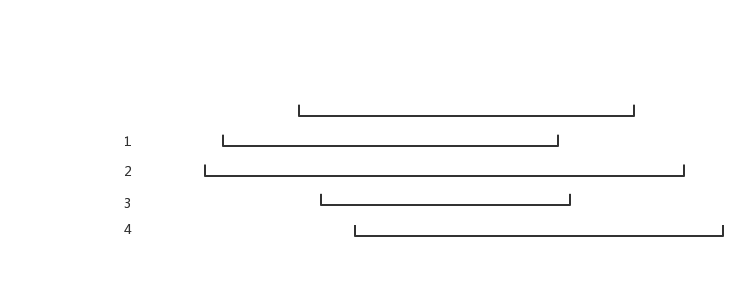
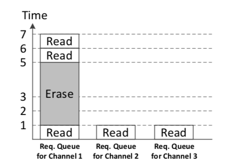

# Related Work

## WiscKey

将Key和value的location（用偏移量来表示offset）存在LSM树中，而真实的value存储在SSD中，为了高效的进行垃圾回收将key和value同时存储在SSD中。

查找数据时，现在LSM树中查找到key和location，再根据location去找对应的value。

插入数据时，将value直接插入log文件末尾，将key和value的位置一起插入LSM树。

删除数据时，直接删除LSM树中对应的key。

日志文件中有效的数据在LSM树中都有对应的key，无效的数据将在垃圾回收时被清除。

垃圾回收时从tail到head开始进行垃圾回收，每次对读取到的数据根据对应的key在LSM树中查找，若是有效数据，则将该条数据重新插入head之后，更新tail指针。为了避免crash发生时的数据不同步，将tail也存储在LSM树中。

## LOCS

LOCS系统分为软件层和硬件层。软件层分为4个层次：LevelDB层，scheduler层，存储API层，SSD驱动层。不同于传统的系统设计，LOCS系统多了一个scheduler层，它的主要任务是为LevelDB发来的请求在SDF上进行规划。

### Extension of LevelDB

LevelDB只有一个后台线程支持Compaction操作。

因为HDD只有一个端口，但SSD支持多channel访问，所以需要对LevelDB进行扩展：

1. 增加Immutable MemTable的个数。当MemTable满了以后，将其转换为Immutable MemTable，并发送给scheduler，由scheduler控制写入存储设备。
2. 增加所有针对HDD的阈值（如`kL0_CompactionTrigger`，`kL0_SlowdownWritesTrigger`，`kL0_StopWritersTrigger`等）。当`SlowdownTrigger`被触发，增加一个额外的后台线程来处理读写Compaction操作。
3. 使用NVM来维护log文件。

### Scheduling adn Dispatching Policies

对写请求进行重新分配特定的顺序会增加吞吐量，提高效率。

* **BaseLine：Round-Robin Dispatching（RR）**

  对所有的channel，以一个循环的顺序依次安排**写操作**。

  当出现一些读操作和擦除操作是，每个channel的队列将不平衡。

* **Least Weighted-Queue-Length Write Dispatching（LWQL）**

  通过维护*队列的带权长度*的表来预测某个队列执行所安排的请求的延迟。为三种请求（读、写、擦除）设置不同的权重，根据公式（1）得出队列的带权长度。
  $$
  Length_{weight}=\sum^N_1 W_i\times Size_i\quad (1)
  $$
  每次将写操作插入到当前权重最小的队列中。

* **Dispatching Optimization for Compation**

  问题：相邻level的且有Overlap的SSTable，若在同一个channel，则会影响下一次Compaction的效率，即读出SSTable的时候，只能顺序读写，而不能并行。

  解决方案：

  1. 记录每个SSTable所在的channel位置。

  2. 对每个由Compaction新生成的SSTable，将最小*队列的带权长度*作为候选，同时需要保证这个channel内不包含该SSTable的四种可能Overlap的文件。

     

     【图1：Four Closest】

* **Scheduling Optimization for Erase**

  问题：Erase操作仅仅发生在Compaction操作时，若Compaction完成后立即进行Erase操作，会延迟读操作；同时等待队列将会变的不平衡，因为Erase和读请求已经根据先前的分配策略所确定。

  

  【图2：已经固定的Erase和读请求】

  解决方案：延迟Erase，当有足够多的写请求时，再安排。设置写请求阈值$TH_w$，当写请求达到阈值后，进行Erase。同时当空白块数量达到阈值时，强制执行Erase。

## Elastic BF

Elastic BF又称为Elastic Bloom Filter。Bloom Filter用于可以快速的检查请求的数据是否存在与SSTable中，从而减少了额外的I/O消耗。一般的BF在不同的level中都使用的同样的配置，也无法动态调整，Elastic BF是一种更细粒度的，更灵活的filter。

### Motivation

高Level的BloomFilter需要更低的容错率，也意味着需要更大的bits-per-key。而bits-per-key越大，所需要的存储空间越大。而原有的设计当中每一层的BloomFilter全部都是固定大小的，并不适应每一层的需求。基于此提出Elastic BloomFilter，对每一层分配不同大小的BloomFilter。

### Main Idea

对每个SSTable建立许多filter，称为filter unit。当需要增加BloomFilter容量时，只需要增加filter unit的个数。将一个SSTable的所有filter unit称为filter group。当查询一个key时，需要所有的filter unit都显示key存在，才真正认为key存在。实现过程中的两个问题：

1. 如何设计策略来动态调整filter unit的个数？
2. 如何实现来尽可能减少调整的开销？

#### Adjusting Rule

定义公式：
$$
E[Extra\_IO]=\sum ^n _{i=1}f_i\cdot f_{p_i}\quad (2)
$$
表示额外的IO开销，BloomFilter目的就是为了减少这个开销。其中$f_i$表示文件$i$访问的频率，$f_{p_i}$表示错误率。

当一个SSTable文件被访问时，首先更新其访问频率，并更新$E[Extra\_IO]$。再检查能否通过增加一个filter unit同时废除一部分filter unit来减少$E[Extra\_IO]$。

#### Dynamic Adjustment with MQ

为了选择一些SSTable作为动态调整BloomFilter的候选。

维护多个LRU队列，$Q_1,\ldots, Q_m$，其中$m$所有SSTable中最大的filter unit的个数。$Q_i$管理了包含$i$个filter unit的SSTable。对每个SSTable，维护两个值：`expiredTime`、`currentTime`。其中`expiredTime = currentTime + lifeTime`，`currentTime`表示迄今为止的Get请求数目，`lifeTime`为常数。

当SSTable被访问了，更新其`currentTime`和`expiredTime`。当所有Get请求数目大于某个SSTable的`expiredTime`时，将该SSTable列入候选。

当有多个SSTable候选时，按照$Q_m$到$Q_1$且从LRU到MRU的顺序，依次选择。对每个选中的SSTable，释放一个filter unit，并下放到下一个level的队列中。

## HashKV

使用了基于哈希的数据分组（data grouping），能够确定性的将values存储在固定的位置，提升更新和垃圾回收的效率。

基于WiscKey的想法，将Key和Value分开存储，Key基于LSM-Tree结构存在内存，Value使用vLog结构存储在外存。

### Limitations

每次GC操作都需要查询LSM-Tree来验证一段数据的有效性。vLog在更新时会产生高达19.7倍的写放大。

### Main Idea

#### Hash-based data grouping

对Key通过哈希函数映射到固定大小的partition，称为main segment，大小为64MB。

#### Dynamic reserved space allocation

当main segment满了以后，HashKV从预留空间中划分出固定大小的单元，称为log segment，大小为1MB。一个main segment可以与多个log segment连接。

#### Hotness awareness

HashKV用打tag的方法来重新安排冷KV到不同的存储区域，以便于区分冷热KV，避免重新拷贝冷KV。

#### Selective KV separation

HashKV对比较小的KV，直接将其存储在LSM-Tree中。

## LSbM-Tree
