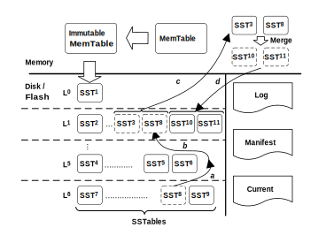
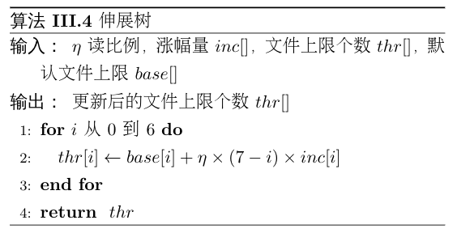
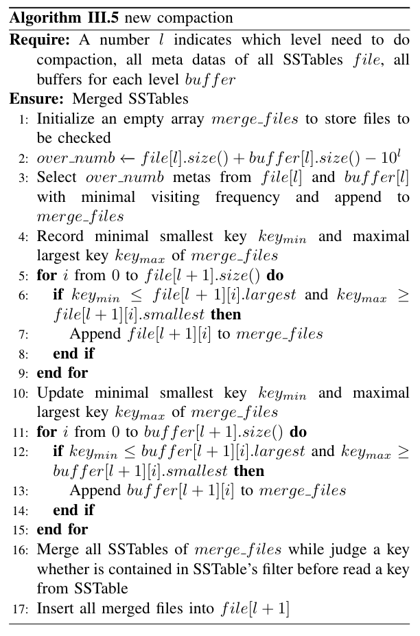

# Idea

major contribution：

1. 重新设计了内存的存储结构；
2. 用CuckooFilter替换BloomFilter；
3. 增加了数据上浮的操作；

## 结构

【图1：整体架构】

### 内存：多级缓存替换

如图1中的Memory部分，在内存中的存储结构，我们用一个LRU2Q+一个MemTable+一个Imm List替换原来的的MemTable+Immutable MemTable组合。数据依次流动从LRU2Q，MemTable，由Immutable MemTable组成的List，最后流入外部存储设备。

每当有数据从LRU2Q中淘汰后会被加入MemTable。当MemTable满了以后，将这个Memtable转换为Immutable MemTable，加入Imm List。当Imm List满了之后，将该List队尾的Immutable MemTable淘汰，存储到外部存储设备中。当数据在LRU2Q中被访问到后，会按照LRU2Q的策略移动在队伍中的位置。

### LRU2Q、MemTable、Imm List大小分配

初始设定每个MemTable和Immutable MemTable最大为$\theta$MB。

若内存不足2$\times\theta$MB，则平均划分内存空间，一半划分为MemTable，一半划分为Imm List，Imm List中只有一个Immutable MemTable。

当内存大于2$\times\theta$MB，优先分配给LRU2Q。设定LRU2Q的大小为MemTable和Imm List的大小之和的$\alpha$倍，Imm List中Immutable MemTable的个数最大为$\beta$个。

定义$g(k)=(1+k)\times\theta\times (1 + \alpha), (1\le k\le \beta)$，表示$k$个大小$\theta$MB的Immutable MemTable时的最小需要内存大小。

当内存大小在$[g(k), g(k+1)]$时，分配$k$个大小为$\theta$MB的Immutable MemTable，一个$\theta$MB的MemTable，剩余空间全分配个LRU2Q。

当内存大小大于$g(\beta)$时，分配$\beta$个大小为$\theta$MB的Immutable MemTable，一个$\theta$MB的MemTable，剩下空间全分配给LRU2Q。

### 外存：上浮缓冲区

如图1中的Disk/Flash部分，因为直接上浮合并的代价较大，我们为每层额外增加了一个Buffer用于存放被上浮的文件。

如图1（a），当$L_5$层中的一个文件被访问后，通过计算得出将其移动到$L_1$层。为了不引起键值范围重叠，将其先放在$L_1$层的`buffer`中，随后在$L_1$层进行Compaction的时候将其合并到`file`中。

如图1（b），当$L_5$层的`buffer`中的一个文件被访问后，同样的通过计算将其移动到$L_0$层，等待合并。

如图1（c），当$L_1$层中的缓冲区满了之后，其中的所有文件通过Compaction的形式加入$L_1$层的`file`中。

#### 1. 确定需要上浮的数据

在外部存储设备中，数据从高层到低层是按照新旧度依次递减的，$L_0$层的数据最新， $L_6$层的数据最旧。根据LevelDB的查找机制来看，查找一个存在于$L_6$层的SSTable比查找一个存在于$L_0$层的SSTable，可能会产生更多的IO读，消耗更多的时间，尤其这个$L_6$层的SSTable近期被频繁访问时，所产生的代价是更大的，因此我们认为**数据分布不仅仅需要考虑数据的新旧度，同时还需要考虑数据的访问频率**。当低层的某个SSTable的访问频率越来越高时，这个SSTable应该通过适当的调整，上浮到高层。

我们对每个SSTable文件记录最近$F$次访问中的访问次数$f$，第$i$层的第$t$个SSTable的最近$F$次访问中的访问次数为$f_{i,t}$，若满足
$$
f_{i,t}\ge min(f_{i-1,u})  \times \gamma (i > 0)\quad (1)
$$
其中$f_{i-1,u}$为第$i-1$层的第$u$个SSTable的最近$F$次访问中的访问次数，$\gamma​$为上浮常数，那么这个SSTable文件需要进行上浮操作。

#### 2. 确定数据上浮的目标层数

若$L_i$层的第$t$个文件需要移动，假设移动到$L_j$层：

用$T_R,T_W$分别表示Flash读一个页和写一个页的时间消耗，$b_l$表示第$l$层的SSTable Buffer最大大小。

假设未来的$F​$次访问中，该文件也将会被访问$f_{i,t}​$次，那么分别计算移动与不移动产生的代价：

- **若不移动文件**：这$f_{i,t}$次访问所带来的时间消耗为：
  $$
  T_1=3\times f_{i,t}\times T_R\times (3 + i + \sum^{i-1}_{l=0}b_l)
  $$
  考虑最坏情况，在每一层（除$L_0$层外）的`file`部分都需要查询一个文件，共计$i-1$个文件，$L_0$层每个文件都需要查询，共4个文件；第$l$层的`buffer`部分的有$b_l$个文件需要查询，所以总共有$4 + i-1 + \sum^{i-1}_{l=0}b_l$个文件需要查询。对于每个文件都需要进行3次IO读（读取FilterBlock，读取IndexBlock，读取DataBlock）。

- **若移动文件**：移动到$L_j​$层，这$f_{i,t}​$次访问所带来的时间消耗为：
  $$
  T_2=3\times f_{i,t}\times T_R \times (3+ j + \sum^{j-1}_{l=0}b_l) + T_W+T_R\times( \sum^{i-1}_{l=j}c_l+1)
  $$
  

  其中$c_l​$表示$L_l​$层与该文件的键值范围有重叠的文件个数。考虑最坏情况，$T_2​$的前半部分为移动到$L_j​$层后的查询该文件的代价，$T_W​$为写入新的Filter的代价，$T_R\times (\sum^{i-1}_{l=j}c_l+1)​$为读取该文件​和读取从$L_{i-1}​$层到$L_j​$层与该文件存在键值范围重叠的文件的Filter的代价。

定义$T_{diff}=T_1-T_2​$表示移动后相比移动前，能够减少的时间代价，若为负数，则表示增加时间代价，那么：
$$
T_{diff} = 3\times f_{i,t}\times T_R \times (i-j + \sum^{i-1}_{l=j} b_l)-T_W-T_R\times( \sum^{i-1}_{l=j}c_l+1) \quad(2)
$$
因为$T_W\approx h\times T_R$，所以公式（3）可以转换为
$$
T_{diff}=3\times f_{i,t}\times T_R \times \left(i - j - h - 1 +\sum^{i-1}_{l=j} (b_l -c_l)\right) \quad(3)
$$
其中$0\le j\le i-1​$。

因为总共只有7层，那么可以通过枚举找到最大的$T_{diff}​$，将该文件移动到对应的层。 

#### 3. 数据上浮

##### 两个性质

1. **除了$L_0$层以外，其他层中的SSTable之间的键值范围不存在重叠**。
2. **数据从$L_0$层到$L_6$层的新旧度逐渐降低，$i$越小的$L_i$层的文件中的数据越新。**

某个文件需要上浮的主要原因是它拥有了高层所不拥有的数据，并且该数据在最近一段时间的访问频率十分高。文件上浮后，为了避免在读取该文件中的其他数据时，读取到旧数据，所以需要上浮的过程去除该文件中的旧数据。

如果直接将上浮时有键值范围重叠的所有SSTable全部读出来，分别和上浮的SSTable比较去重，这个不仅不能减少读的量，反而会增加因上浮所引起的额外的读。所以如何既要不破坏原有2个性质，又不产生很大的额外代价，是上浮操作的关键。

通过对LevelDB查找Key的机制可以发现，当一个SSTable的Filter显示一个Key不存在时，则将不会继续查找数据区域（DataBlock），转而对下一个SSTable查找。

由此我们提出上浮时，仅仅删除Filter中的旧数据，保留数据区域的旧数据，这样只需要修改Filter部分，不会产生大量的额外读。为了能够保持键值范围不重叠的性质，我们提出让上浮的SSTable先暂存在每层设定的缓冲`buffer`中，等`buffer`满了以后，再统一做合并。

#### 4. 使用CuckooFilter

因为LevelDB中使用的BloomFilter，具有一定的错误率，也无法支持删除操作，对上浮操作是十分不利的。所以我们使用空间利用率更高，无错误率且支持删除操作的CuckooFilter替换BloomFilter。

# 例子

## 内存例子

【图2：例子1】

图2（a）展示了一个内存读写的例子。首先依次读键d和键f。在MemTable和Immutable MemTable中分别读取到键d和键f。接下来写入一个新的键j，因为MemTable已经满了，所以需要将此时的MemTable转换成Immutable MemTable，而旧的Immutable MemTable被刷入外部存储设备中，键j写入新的MemTable中。最后读取键c和键e。在Immutable MemTable中读取到键c，而键e已经不在内存中，所以需要到外部存储设备进行读取。

图2（b）展示了一个增加了LRU2Q的内存读写的列子。首先依次读键d和键f。在LRU2Q中读取到键d，并且将键d挪到队列头部，在MemTable中读取到了键f。接下来写入一个新的键j，键j写入LRU2Q的头部，LRU2Q尾部的c被LRU2Q淘汰。因为MemTable已经满了，所以需要将此时的MemTable转换成Immutable MemTable，插入Imm List的尾部。而又因为Imm List已经满了，所以此时将头部的Immutable MemTable刷入外部存储设备中，键c插入新的MemTable中。最后读取键c和键e。在MemTable中读取到键c，在Imm List中读取到键e。

对比（a）和（b），增加LRU2Q能够使频繁访问的键能够在内存中驻留更久的时间，同时也减少了每次刷入外部存储设备的键的数量。

## 外存例子

【图3：例子2】

图3（a）展示了一个外存中读的例子。首先读键d​对应的value，在$L_0$层的SSTable范围是a到f，包括了键d，所以需要对这个SSTable进行检查。因为只包含了键a和键f，所以继续向下一层查找。在$L_1$层的第一个SSTable范围是b到f，也包括了键d，所以也需要对这个SSTable进行检查。同样的因为不包括键d，继续向下一层查找。在$L_2$层的第一个SSTable范围是c到e，包括了键d，同样对这个SSTable进行检查，最终读取到了键d对应的value，结束查找。接下来读键e对应的value，同样的依次检查了$L_0$层，$L_1$层，$L_2$层的SSTable，最终在$L_2$层中读取到键e对应的value。

因为内存中使用了LRU2Q机制，能够使的访问频率相近的键尽可能的存在了同一个SSTable中，所以读取了一个SSTable中的键d，在未来不久也将会读取同一个SSTable中的键e。那么如果将低层最近比较频繁访问的文件上浮到高层，那么将会有效的减少额外的读尝试。

图3（b）展示了带上浮机制的读的例子。首先同样的也是读键d对应的value，依次检查了$L_0$层，$L_1$层，$L_2$层的SSTable，最终在$L_2$层中读取到键d对应的value。此时认为，这个SSTable在未来的操作中可能会被再次访问到，所以将它上浮到$L_0$层中的缓冲SSTable Buffer中。上浮的过程中，因为这个SSTable包含了旧数据键c，与$L_1$层中的第一个SSTable有冲突，所以去除了上浮SSTable的Filter中的键c对应的部分。接下来读取键e对应的value。因为$L_0$层的SSTable范围是a到f，包括了键e，所以对这个SSTable进行检查，发现不包含键d，继续查找。因为$L_0$层的缓冲Buffer不为空，并且缓冲Buffer中的SSTable范围是d到e，包括了键e。对这个SSTable进行检查，读取到了键e对应的value，结束查找。

对比（a）和（b），当SSTable中包括的键更多，且最近访问频率很高时，这种方法提升的效果更为明显。

# Algorithms

**Algorithm 1 内存数据读取**

算法1展示在新增LRU2Q的内存结构中如何查询一个key对应的value的过程。首先在LRU2Q中通过$get(key)$方法查询对应的value，若找到，则直接返回结果。若未找到，在缓冲的immutable Memtable中通过$get(key)​$方法查找。同样的，若找到，则直接返回结果。若未找到，在immutable MemTable的LRU2Q队列中，从队首到队尾，依次在每个immutable MemTable中查找，若找到，则直接返回结果，否则继续查找。若在内存中，都未找到，则返回NULL。

**Algorithm 2 内存存储数据**

算法2展示在新的内存结构中如何存储一对key和value。首先在LRU2Q中通过$put(key, value)$的方法将key和value存储在LRU2Q的中LRU队列的队首，若$key$已经存在了，则直接更新$value$。同时，该方法还会返回从LRU2Q中淘汰的数据$key_{pop}, value_{pop}$。若有数据被淘汰，则需要将其加入到缓冲的MemTable $mem$中。若$mem$已经满了，则将它转换成Immutable MemTable，再加入到Immutable MemTable List $imms$的尾部。然后重新分配一个新的MemTable给$mem$。同时，在将$mem$加入$imms$时，若$imms$中Immutable MemTable的个数已经达到上限，则踢出头部的Immutable MemTable，用指针$imm_{dump}$指向淘汰的Immutable MemTable，将其返回，等待DUMP到$L_0$层。

**Algorithm 3上浮文件**

算法3 展示将$L_i$层的SSTable $M$上浮到$L_j$层的过程。读取$M$的Filter data $S_M$。依次从$L_{i-1}$层到$L_j$层，读出每层所有与SSTable $M$存在键值范围重叠的SSTable的Filter data $S^u_t(i-1\le u\le j)$，将$S_M$求$S_t^u$的相对补集，$S_M \leftarrow S_M-S^u_t$。全部更新完成后，将最终的Filter data 重新写入SSTable $M$中。从$L_i$层删除SSTable$M$的meta信息，并将其加入$L_j$层的$buffer$中。最后检查$buffer[j]$中的SSTable个数是否达到上限，若已经达到上限，则将这些SSTable合并到$file[j]$部分，清空$buffer[j]$。

**Algorithm 4 从外存查询一个key**

算法4展示了如何从外存中查询一个key。从$L_0​$层依次到$L_6​$层，首先从$file[i]​$数组中选择包含$key​$的meta信息加入$check\_files​$备选，然后再从$buffer[i]​$中选择包含$key​$的meta信息加入$check\_files​$。当$L_i​$层的备选meta信息全部选择完毕后，依次检查每个meta信息对应的文件是否包含$key​$。检查的步骤是，首先读取Filter信息，检查$key​$是否存在于Filter中。若不存在继续检查下一个meta信息，若存在读取index块信息，并根据index块信息读取data块信息，查找$key​$是否存在。若找到，返回对应的$value​$，否则继续检查下一个meta信息。若所有层都没有找到$key​$，返回NULL。

**Algorithm 5 改进的Compaction**

算法5展示了在外存中如何做Compaction。因为Compaction的时候可能也会将同层$buffer$中的SSTable DUMP到下一层或者合并部分下一层$buffer$中的文件，所以对于下一层来说，每次Compaction后相比于原来增加的文件数数量可能会超过一个。那么在选择文件时，不再是选择一个文件向下DUMP，而是根据当前层的文件数量阈值$10^{level}$，选择超出阈值数量的文件数$over\_numb$，按照文件新旧程度依次加入$merge\_files$。考虑到选择$n$个文件同时向下Compaction，那么在判断Overlap时，需要和这$n$个文件组成的大区间$[key_{min}, key_{max}]$比较。又因为同一层中$buffer$中的文件可能与$file$中的文件存在Overlap，所以先从$file$中选择Overlap的文件，后更新$key_{min}$和$key_{max}$，再从$buffer$中选择Overlap的文件，将他们均加入$merge\_files$。

选择了所有待合并的文件后，用和原来相同的多路合并策略进行多路合并。需要注意的是，对于每路的SSTable，每当从flash中读出一个$key$准备合并时，先判断该$key$是否存在于该SSTable的Filter中，若不存在直接舍弃这个$key$。最后合并完成后，将合并后的新的SSTable文件加入下一层的$file$数组中。
