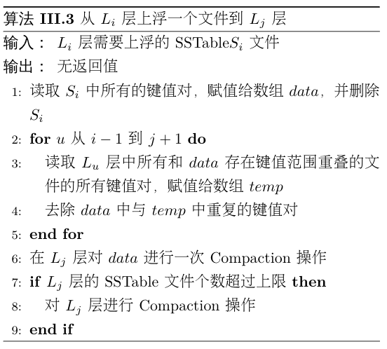

# Algorithm

major contribution：

1. 重新设计了内存的存储结构；
2. 用CuckooFilter替换BloomFilter；
3. 增加了数据上浮的操作；
4. 支持LSMTree的形状变化；

## 内存：多级缓存替换

### 结构

【图3：内存存储结构】

我们提出的内存存储结构中，用LRU2Q替换原有的MemTable，同时维护一个由多个更小的Immutable Memtable组成的Imm LRU。用一个更小的MemTable作为缓冲，每当有数据从LRU2Q中淘汰时，数据将会被加入MemTable。当MemTable满了以后，将其加入Imm List。当Imm LRU满了之后，将该LRU队尾的Immutable MemTable淘汰，DUMP到外部存储设备中。

### 与LevelDB比较

1. 在原有的内存存储结构中，**在MemTable中频繁访问的数据，会因为新数据的加入而被转换成Immutable MemTable，随后DUMP到$L_0$中。当再读这些数据时，都需要进行IO读写。**我们所提出的结构能够让频繁访问的数据长时间被保存在内存中，而不会因为机制的问题而被强制DUMP到外部存储设备中。
2. 同时，在原有的结构中，每当一个Immutable MemTable被DUMP到外部存储设备时，都会创建一个新的空的MemTable，并且因为一个MemTable的大小较大，所以此时内存的利用率会出现较大程度的下降。我们所提出的结构采用更小的MemTable和Immutable MemTable作为一个分配单位，不会较大程度的下降，基本上维持在较高的水准。

### 例子

【图4：例子】

如图4，内存中已经存入了`a,b,c,d,e,f,g,h,i`，如子图1。在原来的结构中，Immutable MemTable中保存了`e,f,g,h,i`，MemTable中保存了`a,b,c,d`，还留有一个空位置；在我们提出的结构中，LRU2Q中，LRU队列保存了`a,b`，FIFO队列保存了`c,d`。MemTable中仅保存了`e`，也还留有一个空位置。Imm LRU中包含了两个Immutable MemTable，分别存储了`f,g`和`h,i`。两种结构中的内存利用率均为90%。

如子图2，当读了`d`和`h`之后，原来的结构中与子图1中没有发生任何变化。而在我们提出的结构中，因为`d`存储在LRU2Q中的FIFO队列，所以被访问了以后，被挪动到LRU队列的头部，并将队尾的`b`踢到FIFO队列中。因为`h`存储在Imm LRU的第二个Immutable中，所以访问了之后，将这个Immutable移动到Imm LRU的头部。需要注意的是，Imm LRU只是为了Immutable MemTable的DUMP而设计，而实际在访问的过程时，仍然按照加入Imm LRU的先后顺序访问，以保证数据的新旧程度。

如子图3，当写入`j`后，原来的结构中的MemTable达到饱和状态。在我们提出的结构中，`j`被加入LRU2Q的LRU队列头部，并将`a`踢入FIFO队列，`c`被LRU2Q淘汰，加入MemTable。此时两种结构的内存利用率均达到最大值100%。

如子图4，当写入`k`后，原来的结构因为MemTable已经饱和，所以将Immutable MemTable DUMP到外部存储设备，并将原来的MemTable转化为Immutable MemTable，创建一个新的MemTable用于接收`k`。而在我们的结构中，`k`被加入LRU2Q的LRU队列头部，并将`d`踢入FIFO队列，`b`被LRU2Q队列淘汰。因为此时MemTable已经饱和，则将其加入Imm LRU。同时，因为Imm LRU中Immutable MemTable的数量达到最大值，需要将队尾的包含`f,g`的Immutable MemTable DUMP到外部存储设备。之后再将MemTable转化为Immutable MemTable，加入Imm LRU的头部。最后创建新的MemTable，接收被LRU2Q淘汰的`b`。此时，原来结构中的内存利用率达到最小值60%，而我们的结构中仍然保持在90%。

如子图5，当读取`i`和`e`时，在原有的结构中，因为`i,e`之前存在于同一个Immutable MemTable此时已经被DUMP到外部存储设备，所以现在需要从外部存储设备通过IO读取数据。在我们提出的结构中，因为`e`和`i`仍处于内存中，所以读取的速度更快。

### 大小分析

内存空间最少需要保证一个MemTable和一个Immutable Memtable（默认均2MB）。

若内存不足4MB，则按平均分一半划分为MemTable，一半划分为Immutable MemTable。

当内存大于4MB，优先增加LRU2Q的大小。当LRU2Q的大小为所有MemTable和Immutable MemTable的2倍时，增加一个Immutable MemTable。当Immutable MemTable数量达到设定上限（默认为4）时，剩下的内存均分配给LRU2Q。

### 伪代码

**Algorithm 1 内存数据读取**

算法3.1展示在新的内存结构中如何查询一个key对应的value的过程。首先在LRU2Q中通过$Get(key)$方法查询对应的value，若找到，则直接返回结果。若未找到，在缓冲的immutable Memtable中通过$Get(key)$方法查找。同样的，若找到，则直接返回结果。若未找到，在immutable MemTable的LRU2Q队列中，从队首到队尾，依次在每个immutable MemTable中查找，若找到，则直接返回结果，否则继续查找。若在内存中，都未找到，则返回NULL。

**Algorithm 2 内存存储数据**

算法3.2展示在新的内存结构中如何存储一对key和value。首先在LRU2Q中通过$Put(key, value)$的方法将key和value存储在LRU2Q的中LRU队列的队首，若$key$已经存在了，则直接更新$value$。同时，该方法还会返回从LRU2Q中淘汰的数据$d\_key, d\_value$。若有数据被淘汰，则需要将其加入到缓冲的Immutable MemTable$imm\_temp\_$中。若$imm\_temp\_$已经满了，则将它加入到immutable MemTable的LRU队列$imms\_$的头部，重新分配一个新的Immutable MemTable。同时，若$imms\_$已经满了，则淘汰队尾的Immutable MemTable，用指针$imm\_dump\_$指向淘汰的Immutable MemTable，将其返回，等待DUMP到$L_0$层。

## 外存：数据上浮，替换Filter

### 结构

【图5：外部存储结构】

如图5，我们为每层额外增加了一个buffer用于存放被上浮的文件。

如图5（a），当$L_5$层中的一个文件被访问后，通过计算得出将其移动到$L_1$层。为了不引起Overlap，将其先放在$L_1$层的额外的list中，随后在$L_1$层进行Compaction的时候将其合并到file中。

如图5（b），当$L_5$层额外的list中的一个文件被访问后，同样的通过计算将其移动到$L_0$层，等待合并。

### 需要解决的问题

1. 数据如何上浮？
2. 数据上浮的层数？
3. 哪些数据需要上浮？

#### 1. 数据如何上浮？

##### 两个性质

1. **除了$L_0$层以外，其他层中的SSTable之间的键值范围不存在Overlap**。对于$L_0$层来说，数据是直接从内存DUMP下来的，若要保持不存在Overlap的特性，在DUMP的同时还需要进行多路归并，但是考虑到IO读写的代价对性能的影响，所以允许Immutable MemTable直接生成SSTable，直接DUMP到$L_0$层，其该层的SSTable之间的键值范围存在Overlap。$L_0$层至多只有4个SSTable，这也相对有了一定的折中，保证了查找效率。其他层的文件都是通过Compaction得到的，所以可以保证不存在Overlap，文件数量也可以成倍增长，查找时可以通过二分查找加快查找效率。
2. **数据从$L_0$层到$L_6$层的新旧度逐渐降低，** $i$越小的$L_i$层的文件中的数据越新。若某个Key同时存在于多层的多个SSTable中，则$i$最小的层中的Key对应的是最新的数据，其他层的数据均已无效。特别地，对$L_0$层来说，因为允许不同的SSTable之间的键值范围存在Overlap，所以越靠前即$j$越小的SSTable中的数据越新。

##### 为什么要换成CuckooFilter

文件M需要上浮的主要原因是它拥有了高层所不拥有的数据，并且该数据在最近一段时间的访问频率十分高。文件上浮后，为了避免在读取该文件中的其他数据时，读取到旧数据，所以需要上浮的过程去除该文件中的旧数据。

可以发现，在查找一个Key之前，LevelDB为了提高查找效率，对每个SSTable增加了一个Filter，用于快速判断一个Key是否存在在当前的SSTable中。因为Filter所能表示的Key的个数和实际SSTable的Key的个数是一样的，那么**可以把Filter看作整个SSTable的一个snapshot**。在去除旧数据时若能够只删除Filter中的数据，而不删除DataBlock中的数据，将会大大减少上浮产生的代价。**若DataBlock中某个Key是旧数据，那么上浮完成后在对应的Filter中这个Key已经被删除了，在Filter中就永远不会被查询到，就不会进一步查询DataBlock**。

LevelDB中引入的是BloomFilter，但它具有以下几点不足：

1. 存在一定的错误率，将不存在的Key可能会返回存在。
2. 无法进行删除操作。

我们将文件上浮以后，需要继续保持原有的两个性质，我们使用查询效率更高，空间利用率更高，且无错误率的CuckooFilter[CuckooFilter]来替换BloomFilter。

##### 具体操作

【图6：求过滤器的相对补集】

对于$L_i$层的文件M，用集合$S_M$表示文件M对应的CuckooFilter。设$L_{j}$层有$k$个文件与文件M表示的键值范围有交集，他们对应的CuckooFilter分别为$S^u_1,\ldots,S^u_k$，那么将文件M移动到$L_{j}$层后，它的CuckooFilter变为$S_M=S_M-S^u_t\quad \{u=i-1,\ldots,j,t=1,\ldots,k\}$。若一个SSTable至多有$n$个KV数据，那么该操作的时间复杂度为$O((i-j)\cdot k\cdot n)$ 。根据实验数据分析可以看出，$k$的值不超过5[LOCS]，$i-j$的大小也不会超过6，每上升一层，CuckooFilter中存储的Key的个数$n$只会逐渐减少。

#### 2. 数据上浮的层数？

对于$L_i$层的文件M，将它移动到$L_j$层：

设$T_R,T_W$分别表示Flash读一个页和写一个页的时间消耗。假设未来的$F$次访问中，文件M也将会被访问$f_{i,M}$次，同时文件M不会被Compaction，那么考虑移动与不移动分别产生的代价：

- 不移动文件M：这$f_{i,M}$次访问所带来的时间消耗为：$T_1=f_{i,M}\times 3\times T_R\times (3 + i + i\times LIST\_MAX\_NUM)$。最坏情况下，在每一层（除$L_0$层外）的`file_`部分都需要查询一个文件，共计$i-1$个文件，$L_0$层每个文件都需要查询，共4个文件；每一层的`list_`部分的每个文件都需要查询，根据预设每层至多有$LIST\_MAX\_NUM$个文件存储在$list\_$中，所以总共有$4 + i-1 + i\times LIST\_MAX\_NUM$个文件需要查询，对于每个文件都需要进行3次IO读（读取FilterBlock，读取IndexBlock，读取DataBlock）。
- 将文件M移动到$L_j$层，这$f_{i,M}$次访问所带来的时间消耗为：$T_2=f_{i,M}\times 3\times T_R \times (3+ j  + j\times LIST\_MAX\_NUM) + T_W+T_R\times( \sum^j_{k=i-1}c_k+1)$，其中$c_k$表示$L_k$层与文件M的键值范围有Overlap的文件个数。最坏情况下，$T_2$的前半部分为移动到$L_j$层后的查询文件$M$的代价，$T_W$为写入新的Filter的代价，$T_R\times (\sum^j_{k=i-1}c_k+1)$为读取文件$M$及从$L_{i-1}$层到$L_j$层与文件$M$存在Overlap的文件的Filter的代价。

定义$T_{diff}=T_1-T_2$表示移动后相比移动前，能够减少的时间代价，若为负数，则表示增加时间代价，那么：
$$
T_{diff}=T_1-T_2=f_{i,M}\times 3\times T_R\times (3 + i + i\times LIST\_MAX\_NUM) \\- f_{i,M}\times 3\times T_R \times (3 + j + j\times LIST\_MAX\_NUM) \\- T_W -T_R\times( \sum^j_{k=i-1}c_k+1)
\\
T_{diff} = f_{i,M}\times 3\times T_R \times (i-j)\times(LIST\_MAX\_NUM + 1)\\-T_W-T_R\times( \sum^j_{k=i-1}c_k+1) \quad(3)
$$
因为$T_W\approx \alpha\times T_R$，所以公式（3）可以转换为
$$
T_{diff}=f_{I,m}\times 3\times (i-j)\times(LIST\_MAX\_NUM+1)- \sum^j_{k=i-1}c_k-1-\alpha \quad(4)
$$
其中$0\le j\le i-1$，$LIST\_MAX\_NUM$不超过10。

因为$i$不超过6，那么依次枚举每个$j$，找到最大的$T_{diff}$，将文件M移动到$L_j$层。 

#### 3. 哪些数据需要上浮？

在外部存储器中，数据从高层到低层是按照新旧度依次递减的，$L_0$层的数据最新， $L_6$层的数据最旧。根据前文所叙述的访问机制来看，相比于高层的SSTable，查找低层的SSTable会消耗更多的时间。当一个低层的SSTable近期被频繁访问时，所产生的代价是很大的，因此我们认为**数据分布不仅仅需要考虑数据的新旧度，同时还需要考虑数据的访问频率**。当低层的某个SSTable的访问频率越来越高时，这个SSTable应该通过适当的调整，上浮到高层。

我们对每个SSTable文件记录最近$F$次访问中的访问次数$f$，第$i$层的第$j$个SSTable的最近$F$次访问中的访问次数为$f_{i,j}$，若满足
$$
f_{i,j}\ge min(f_{i-1,k})  \times \beta (i > 0)\quad (2)
$$
其中$f_{i-1,k}$为第$i-1$层的第$k$个SSTable的最近$F$次访问中的访问次数，$\beta$为常数，那么这个SSTable文件需要进行上浮操作。

### 例子

### 算法

#### 上浮后去除旧数据

**Algorithm 3 维护最近$F$次访问频率**

算法3.3 展示了如何维护最近$F$次访问的文件序号。若$F$较小，则等价于将所有的文件序号放在一个FIFO中。若$F$较大，则在内存中维护2个FIFO，分别表示原来的一个FIFO的头部和尾部。删除数据时从头部FIFO$visit\_[0]$头部删除，添加数据时从尾部FIFO$visit\_[1]$尾部添加。

**Algorithm 4 上浮文件**

算法3.4 展示将$L_i$层的文件$M$上浮到$L_j$层的过程。读取$M$的Filter data $S_M$。依次从$L_{i-1}$层到$L_j$层，读出每层所有与文件$M$存在Overlap的文件的Filter data $S^u_t(i-1\le u\le j)$，将$S_M$求$S_t^u$的相对补集，$S_M-S^u_t$。全部更新完成后，将最终的Filter data 重新写入文件$M$中。从$L_i$层删除文件$M$的meta信息，并将其加入$L_j$层的$buffer$中。

**Algorithm 5 从外存查询一个key**

算法3.5展示了如何从外存中查询一个key。从$L_0$层依次到$L_6$层，首先从$file[i]$数组中选择包含$key$的meta信息加入$check\_files$备选，然后再从$buffer[i]$中选择包含$key$的meta信息加入$check\_files$。当$L_i$层的备选meta信息全部选择完毕后，依次检查每个meta信息对应的文件是否包含$key$。检查的步骤是，首先读取Filter信息，检查$key$是否存在于Filter中。若不存在继续检查下一个meta信息，若存在读取index块信息，并根据index块信息读取data块信息，查找$key$是否存在。若找到，返回对应的$value$，否则继续检查下一个meta信息。若所有层都没有找到$key$，返回NULL。

**Algorithm 6 改进的Compaction**

算法3.6展示了在外存中如何做Compaction。因为Compaction的时候可能也会将同层$buffer$中的SSTable DUMP到下一层或者合并部分下一层$buffer$中的文件，所以对于下一层来说，每次Compaction后相比于原来增加的文件数数量可能会超过一个。那么在选择文件时，不再是选择一个文件向下DUMP，而是根据当前层的文件数量阈值$10^{level}$，选择超出阈值数量的文件数$over\_numb$，按照文件新旧程度依次加入$merge\_files$。考虑到选择$n$个文件同时向下Compaction，那么在判断Overlap时，需要和这$n$个文件组成的大区间$[key_{min}, key_{max}]$比较。又因为同一层中$buffer$中的文件可能与$file$中的文件存在Overlap，所以先从$file$中选择Overlap的文件，后更新$key_{min}$和$key_{max}$，再从$buffer$中选择Overlap的文件，将他们均加入$merge\_files$。

选择了所有待合并的文件后，用和原来相同的多路合并策略进行多路合并。需要注意的是，对于每路的SSTable，每当从flash中读出一个$key$准备合并时，先判断该$key$是否存在于该SSTable的Filter中，若不存在直接舍弃这个$key$。最后合并完成后，将合并后的新的SSTable文件加入下一层的$file$数组中。

# REF

[LSM-tree]：The Log-Structured Merge-Tree

[GoogleWeb]：https://github.com/google/leveldb

[BloomFilter]：

[CuckooFilter]：Cuckoo FIlter：Practically Better Than Bloom

[LOCS]：An Efficient Design and Implementation of LSM-Tree based Key-Value Store on Open-Channel SSD 

[BigTable]：F. Chang, J. Dean, S. Ghemawat, W. C. Hsieh, D. A. Wallach, M. Burrows, T. Chandra, A. Fikes, and R. E. Gruber. Bigtable: A distributed storage system for structured data. ACM Trans. Comput. Syst., 26(2):4:1–4:26, June 2008 

[WiscKey]：

[PA CuckooFilter]：Minseok Kwon, Vijay Shankar, Pedro Reviriego:Position-aware cuckoo filters. ANCS 2018: 151-153

[Counting BloomFilter]：L. Fan, P. Cao, J. Almeida, and A. Z. Broder. Summary cache: A scalable wide-area Web cache sharing protocol. In Proc. ACM SIGCOMM, Vancouver, BC, Canada, Sept. 1998. 

[Blocked BloomFilter]：F. Putze, P. Sanders, and S. Johannes. Cache-, hash- and spaceefficient bloom filters. In Experimental Algorithms, pages 108–121. Springer Berlin / Heidelberg, 2007. 

[d-left Counting BloomFilter]：F. Bonomi, M. Mitzenmacher, R. Panigrahy, S. Singh, and
G. Varghese. An improved construction for counting bloom filters. In 14th Annual European Symposium on Algorithms, LNCS 4168, pages 684–695, 2006. 

[CuckooHash]：R. Pagh and F. Rodler. Cuckoo hashing. Journal of Algorithms,51(2):122–144, May 2004. 