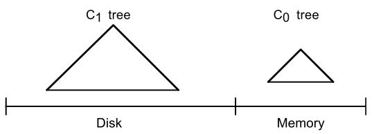

# LSMTree

一个LSM-Tree可以由多个组件$C_0,C_1,\ldots, C_k$构成，其中$C_0$存在于***内存***之中，剩余的$C_1,\ldots,C_k$存在于***外存***之中。每个组件都是由一个数据结构来维护，一般来说$C_0$由<u>**2-3树，AVL树**</u>等构成，$C_1,\ldots,C_k$由<u>**满节点的B树**</u>构成，同时$C_1$到$C_k$的规模逐渐增大。

## 二组件的LSM-Tree

最简单的LSM-Tree包含两个组件，常驻内存的称为$C_0$树，常驻外存的称为$C_1$树。

【图1 两个部件构成的LSM-Tree】

$C_1$树的结构类似B树，不同的是每个节点都是**全满的**，类似SB树[SB-Tree]。

当有一个新数据被生成后，将进行如下步骤的操作：

1. 将用于恢复这个插入操作的日志记录写入日志文件。
2. 将该数据的索引插入$C_0$树。

当$C_0$树达到阈值时，需要将$C_0$树中的一部分数据迁移到$C_1$树中。这个操作叫做**Rolling Merge**，它删除了$C_0$树中连续的片段，并将这些片段合并到$C_1$树中。

# LevelDB

LevelDB是Google开源的持久化KV数据库，具有很高的随机写、顺序读/写性能，但随机读性能一般。LevelDB应用了LSM树的结构，对索引变更进行延迟及批量处理，并通过类归并排序的方法高效的将数据更新迁移到磁盘，降低索引插入的开销。

## 存储结构

REF[https://github.com/google/leveldb/blob/master/doc/impl.md]

LevelDB在内存中主要的数据存储结构为两个有序跳表（skiplist），一个为可变表，称为MemTable，另一个是只读的不可变表，称为Immutable MemTable；在磁盘中的主要存储结构为一系列的有序字符表，称为SSTable，一个MANIFEST文件，一个CURRENT文件以及一些log文件等辅助文件。这些文件之间的组织形式如图2。

【图2 存储模型快照】

### SSTable

每个SSTable存储了一系列根据key的值排序的条目，每个条目要么是key对应的value，要么是key对应的删除标志。这些SSTable被分为7个等级，自顶向下依次用$L_0$到$L_6$来表示。除了$L_0$层以外，其他层中不包含重复的key，$L_0$层中的数据从Immutable MemTable中得到。每一层都有一个最大SSTable的数量，且随着层数增大依次按一定比率增大。

每个SSTable文件的上限是2MB，由若干个4KB大小的block组成，最后一个block用于存储每个block的index信息和第一个key的值。同一个block中的key可以共享前缀，每个key只需存储自己唯一的后缀即可。若仅有部分key可以共享前缀，这部分key和其它key之间插入“reset”标识。

### MANIFEST文件

MANIFEST文件罗列了当前层所包含的SSTable文件，当前层所表示的键值范围和其他的重要的数据。

### CURRENT文件

由于Compaction是在后台进行的，LevelDB将会维护多个版本的数据，CURRENT文件指出当前哪些文件是最新的文件。

## 读写操作

### 写操作

每当需要插入一个键值对到LevelDB时，

1. 将待插入的键值插入磁盘中的日志文件中；
2. 同时也插入到内存中的可变表中；
3. 当内存中的可变表满了以后，LevelDB使用一个新的可变表，同时之前的可变表转换成了只读的不可变表，随后通过一个压缩操作将它流向磁盘中的$L_0$级：生成一个新的SSTable文件，将不可变表中的数据拷贝至SSTable，将这个SSTable放入$L_0$级，之前的可变表和日志文件随后被丢弃。

### 读操作

1. 在内存中依次查找MemTable，Immutable MemTable
2. 若配置了Cache，查找Cache
3. 根据MANIFEST索引文件，在磁盘中查找SSTable。

## 压缩操作

为了加快读取速度，LevelDB利用压缩操作对已有的键值对记录进行整理压缩，删除一些不再有效的键值对数据，减少数据规模，减少文件数量。

LevelDB中的压缩操作分为3种类型：

* minor compaction：将immutable的数据导出到SSTable文件中。
* major compaction：合并不同层级的SSTable文件。
* full compaction：合并所有的SSTable。

### minor compaction

当内存中MemTable大小达到阈值时，需要将MemTable转换成Immutable MemTable，再将数据迁移到磁盘中。因为Immutable MemTable是一个SkipList，其中的数据根据Key有序排列的，所以只需依次写入Level 0中的SSTable，并建立index数据即可。

### major compaction

当$L_i$层的SSTable数量达到上限时，就需要向下进行压缩。首先从$L_i$层中选择一个SSTable，同时在$L_{i+1}$层中选择所有与其表示的范围有交集的SSTable。将这些SSTable按照键值范围进行合并，按照SSTable的上限大小划分成新的多个SSTable，最终插入到$L_{i +1}$层中。

需要注意的是$L_0$到$L_1$的压缩操作与其他层之间的压缩操作有所不同，因为在$L_0$中，自己的SSTable之间表示的键值范围就有所相交，所以从$L_0$层中可能会选择出超过一个的SSTable。

对$L_i$层，上一次的压缩操作是的最后一个键值将被记录，用于在下一次压缩时，选择第一个从这个键值开始的文件。

## 版本控制

当执行一次compaction或创建一个Iterator时，LevelDB将在当前版本的基础上创建一个新的版本。

LevelDB用VersionSet来管理所有的Version，用VersionEdit来表示Version之间的变化，相当于增量。

`Version0 + VersionEdit --> Version1`

# Flash

# Related Work

## WiscKey

将Key和value的location（用偏移量来表示offset）存在LSM树中，而真实的value存储在SSD中，为了高效的进行垃圾回收将key和value同时存储在SSD中。

查找数据时，现在LSM树中查找到key和location，再根据location去找对应的value。

插入数据时，将value直接插入log文件末尾，将key和value的位置一起插入LSM树。

删除数据时，直接删除LSM树中对应的key。

日志文件中有效的数据在LSM树中都有对应的key，无效的数据将在垃圾回收时被清除。

垃圾回收时从tail到head开始进行垃圾回收，每次对读取到的数据根据对应的key在LSM树中查找，若是有效数据，则将该条数据重新插入head之后，更新tail指针。为了避免crash发生时的数据不同步，将tail也存储在LSM树中。

## LOCS

LOCS系统分为软件层和硬件层。软件层分为4个层次：LevelDB层，scheduler层，存储API层，SSD驱动层。不同于传统的系统设计，LOCS系统多了一个scheduler层，它的主要任务是为LevelDB发来的请求在SDF上进行规划。

修改LevelDB以支持SDF。

### Round-Robin Dispatching（RR）

对所有的channel，以一个循环的顺序依次安排**写操作**。

当出现一些读操作和擦除操作是，每个channel的队列将不平衡。

### Least Weighted-Queue-Length Write Dispatching（LWQL）

通过一个队列的带权长度表来预测某个队列执行所安排的请求的延迟。首先为三种请求（读、写、擦除）设置不同的权重，然后根据下面公式得出队列的带权长度。
$$
Length_{weight}=\sum^N_1 W_i\times Size_i\quad (1)
$$
每次将写操作插入到当前权重最小的队列中。

## Elastic BF

Elastic BF又称为Elastic Bloom Filter。Bloom Filter用于可以快速的检查请求的数据是否存在与SSTable中，从而减少了额外的I/O消耗。一般的BF在不同的level中都使用的同样的配置，也无法动态调整，Elastic BF是一种更细粒度的，更灵活的filter。

## Splaying LSM

核心思想是借鉴于Splay Tree的数据结构，将频繁访问的键通过旋转或者拷贝至LSM树的高level中。

### AlwaysSplay

对每个get操作都会触发一个put操作，即将该对应的键值拷贝到高level。

### FlexSplay

对每个get操作触发put操作之前，先将拷贝了的键值对标记splayed。当进行向下合并的时候，对于标记为splayed的数据根据当前的状态估计保留该键值的收益，否则删除。

# Ideas

基于Flash的LevelDB，在不影响原有的Compaction速度的基础上优化**读放大问题**。

* 原有的查找方法
  * 查找MemTable，再查找Immutable MemTable。
  * 依次查找$L_i$层的SSTable文件，$L_0$层与其他层需要区分：
    * $L_0$层顺序遍历每个SSTable文件。
    * 其他层中可以根据每个SSTable对应的FileMetaData记录的最大键值做二分查找。
  * 找到潜在的SSTable文件后，将index_block内的内容加载入Cache。

**数据记录：**

为每个文件在内存中维护最近命中次数**Hit**。对每次查找，将最终命中的文件的Hit增加一。

**交换时机：**

当$Hit_{L_{i+1}, j}>=Hit_{L_i,k} \times \alpha$时，将存储在内存中$L_{i+1}$层的SSTable文件$j$和$L_i$层的SSTable文件$k$的逻辑地址（文件指针）交换，并分别在$L_i$层和$L_{i+1}$层标记记录这两个文件。

对$L_i$层来说，若发生了交换操作之前就已有已经标记好的文件$p$，则将新文件$q$与文件$p$合并。需要注意的是，当合并两个文件时，需要注意两个文件的新旧程度，根据文件的新旧程度抛弃旧文件中相同key的数据。文件原来属于层数越低，则文件的新鲜程度越高。

**懒操作：**

为了不破坏原来的LevelDB中的每层数据结构类型，当文件加入新的一层时应该与该层所有有Overlap的文件进行合并，但是这个合并操作的代价很大，同时若不合并的话，最多对原来的查找文件的数量每层增加一个，同时标记文件相比于原有的文件是旧文件。

向下Compation时，若选择到了标记文件，则取消标记。

## 难点

数据何时载入内存，载入多少？

如何快速确定哪有包含指定Key的SSTable文件？（用原有的方法？）

ROLLBACK时机？哪些文件ROLLBACK？

是否需要替换上层文件？

# 讨论

* 算法：向上Compaction，利用Lazy操作，延迟Compaction，等到实在需要Compaction时再进行Compaction。
* 列出存在的难点、问题。
* 针对大多数情况：
  * 顺序读顺序写
  * 顺序读随机写
  * 随机读顺序写
  * 随机读随机写
* 
* 实验：在磁盘上开出一段空间模拟flash，拿到操作序列，再重新计算时间消耗。

# 引用

[SB-Tree] Patrick E. O'Neil, "The SB-tree: An index-sequential structure for high-performance sequential access", Acta Informatica 29, 241-265 (1992).