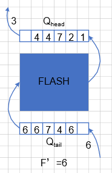

# Background

## LevelDB

LevelDB是Google开源的持久化KV数据库，具有很高的随机写、顺序读/写性能，但随机读性能一般。LevelDB在外存存储时使用了LSM-Tree*[LSM-tree]*的结构，对索引变更进行延迟及批量处理，并通过多路归并的方法高效的将数据更新迁移到磁盘，降低索引插入的开销*[GoogleWeb]*。

【图1：LevelDB结构】【**图待修改**】

图1是LevelDB的整体结构，在内存中键值对数据存储在一个由跳表实现的MemTable中，当MemTable写满后，LevelDB将它被转换成一个不可写的Immutable MemTable，等待着被移动到外存，并创建一个新的空的MemTable接受新的输入。在外存中，键值对数据存储在一系列SSTable中，这些SSTable被划分为7个层级，依次是$L_0$层到$L_6$层，每层所包含的文件数依次成倍数增长。同时外存中还存储一些辅助用的日志文件，如每层都对应一个MANIFEST文件，它罗列了当前层所包含的SSTable文件，当前层所表示的键值范围和其他的重要的数据。

SSTable是LevelDB在外存中主要的数据组织形式，每个SSTable文件可以划分成4个区域：数据块区域，索引块区域，过滤器块区域，footer块区域。数据块区域由许多数据块构成，每个数据块包含许多个键值对数据。索引块区域包含一个索引块，它存储了每个数据块的最大值、在文件中的偏移量等相关信息，偏于快速定位到数据所在的数据块。过滤器块区域包含一个或多个过滤器块，为了加速查找过程，快速确定一个数据是否存在于一个SSTable文件中， LevelDB给每个SSTable增加了一个布隆过滤器*[BloomFilter]*。footer块区域存储了每个区域在SSTable文件中的相应位置。

$L_0$层到$L_6$层，除了$L_0$层以外，其他层内的所有SSTable表示的键值范围不存在Overlap。当$L_i$层的SSTable数量达到了上限或某个SSTable长时间未被命中，LevelDB将从$L_i$层中选择一个SSTable，通过Compaction操作将其中的有效数据流动到$L_{i+1}$层。LevelDB的Compaction操作主要可以分为2种类型：minor compaction，major compaction。LevelDB会自动检查Immutable MemTable是否存在，若存在则执行minor compaction，将Immutable MemTable封装成一个SSTable，加入$L_0$层。major compaction是在外存中主要的Compaction操作，它将$L_i$层的一个SSTable中的有效数据流动到$L_{i+1}$层。具体操作为首先从$L_i$层中确定需要compaction的SSTable，同时在$L_{i+1}$层中选择所有与其表示的键值范围有交集的SSTable。将这些SSTable利用类归并排序的思想按照键值范围进行多路归并。当某个键在$L_i$层和$L_{i+1}$层的SSTable同时出现时，按照数据的新鲜程度，将$L_{i+1}$层的键值抛弃，保留$L_i$层的键值。最后合并好的数据再划分成新的多个SSTable，插入到$L_{i +1}$层中，此时这几个SSTable表示的键值范围不存在Overlap。

## Flash

# Motivation

目标：**基于Flash的LevelDB，在不影响原有写性能的基础上优化读放大问题**。

## Read Amplification in LevelDB

在LevelDB查找一个Key的步骤主要可以分为**在内存查找**和**在外存查找**两步：

1. 在内存中，首先在MemTable中查找，若没有找到，则检查Immutable MemTable是否存在。若存在，在Immutable MemTable中查找。
2. 若在内存中均未找到，则在外存中查找。因为数据存在于外存中的SSTable文件中，所以首先要确定数据所在的SSTable文件，其次再从对应的SSTable文件中读取具体的数据。
   1. 内存中维护了所有SSTable的Meta信息，包括SSTable的最小值、最大值等。除$L_0$层外，其他层均可以通过二分查找确定Key可能存在的SSTable。$L_0$层因为存在Overlap，所以只能依次遍历判断。
   2. 确定了Key可能存在的SSTable时，需要读取SSTable文件来判断Key是否真正存在于这个SSTable中，这个步骤可以通过至多3次IO读写来实现。
      1. 读取BloomFilter Block，根据BloomFilter确定Key是否存在，若存在则进行下一步，否则检查下一个可能的SSTable。
      2. 读取IndexBlock，确定Key所在的DataBlock的索引。
      3. 读取Key所在DataBlock，查找Key对应的Value。若不存在Key，则检查下一个可能的SSTable，否则结束查找，返回对应的Value。

从上述的查找流程发现，原本查找Key所在的一个SSTable，却因为特殊的索引结构多读了好几个SSTable，才能找到待查找的Key真正所在的位置。根据统计可以知道，基于LevelDB的读放大平均达到了<u>？</u>倍。造成读放大的原因是因为Compaction机制的引入，将数据逐渐向低层流动。当查找一个真正存在于低层的Key时，因为可能每一层都会有一个SSTable的范围包括了这个Key，所以在每一层都需要进行至多3次IO去检查一下这个Key是否存在在那层的SSTable中。

为了解决这个读放大的问题，我们认为数据的流动方向不应该只是从$L_0$到$L_6$的，同时也应该可以**从$L_6$流向$L_0$，**同时外存中的数据不应该仅仅按照新鲜程度从上至下分布，还应该**随着数据的访问频率而动态分布**。当低层数据最近频繁被访问时，应该将其向高层流动，从而提高读性能。同时，因为原来一次的Compaction的overhead是十分巨大的，所以**数据上浮时不应该再引入较大的overhead**。

# Algorithm

major contribution：

1. 重新设计了内存的存储结构；
2. 用CuckooFilter替换BloomFilter；
3. 增加了数据上浮的操作；

## 内存：二级缓存替换MemTable，多Immutable MemTable

【图2：内存存储结构】**【图待修改】**

在原有的机制中，MemTable在满了以后就直接转换成Immutable MemTable，随后等待DUMP到$L_0$中。而**此时在MemTable中频繁访问的数据，将会直接随着原有机制一直DUMP到$L_0$中，当再读这些数据时，都需要读取外存中的SSTable**。为了改进这个问题，我们提出用LRU2Q来替换MemTable，当数据从2Q淘汰后，再将其加入Immutable Memtable。我们还提出内存中不再只有一个Immutable Memtable，而是同时存在n个Immutable MemTable，这n个Immutable MemTable存在于内存的一个长度为$N$的LRU队列中，每次将从该LRU队列中淘汰的Immutable MemTable DUMP到$L_0$中。

LRU2Q由两个队列构成，一个是基于LRU的队列，另一个是FIFO队列。新数据都被直接插入LRU队列；当数据在两个队列中被访问到时，将数据移动到LRU队列的头部；当数据被LRU队列淘汰时，将按照FIFO的规则插入FIFO队列的头部；当数据被FIFO队列淘汰后，则意味着被2Q所淘汰。

被2Q淘汰的数据直接加入到一个缓冲Immutable MemTable中。当这个Immutable MemTable达到阈值后，将其直接插入到LRU队列的头部。当LRU队列其中某个Immutable MemTable中的Key被访问后，将这个Immutable MemTable移动到LRU队列的头部；当某个Immutable MemTable被这个LRU队列淘汰后，将它DUMP到$L_0$层中。

假设内存大小为$M$，LRU2Q中每个队列占的大小分别为$M_1, M_2$，默认认为$M_1 = M_2$；每个Immutable MemTable的大小固定为$M_{IM}$，默认2MB，那么需要满足：
$$
M_1 + M_2 + N\times M_{IM} \le M\quad (1)
$$
在分配内存空间时，将$M\times \alpha$的内存空间分配给LRU2Q，$M\times(1-\alpha)$的内存空间分配给Immutable MemTable 。内存中至少预留1个Immutable MemTable的空间，若不够，则降低Immutable MemTable的大小。

**Algorithm 1 内存数据读取**

算法3.1展示在新的内存结构中如何查询一个key对应的value的过程。首先在LRU2Q中通过$Get(key)$方法查询对应的value，若找到，则直接返回结果。若未找到，在缓冲的immutable Memtable中通过$Get(key)$方法查找。同样的，若找到，则直接返回结果。若未找到，在immutable MemTable的LRU2Q队列中，从队首到队尾，依次在每个immutable MemTable中查找，若找到，则直接返回结果，否则继续查找。若在内存中，都未找到，则返回NULL。

**Algorithm 2 内存存储数据**

算法3.2展示在新的内存结构中如何存储一对key和value。首先在LRU2Q中通过$Put(key, value)$的方法将key和value存储在LRU2Q的中LRU队列的队首，若$key$已经存在了，则直接更新$value$。同时，该方法还会返回从LRU2Q中淘汰的数据$d\_key, d\_value$。若有数据被淘汰，则需要将其加入到缓冲的Immutable MemTable$imm\_temp\_$中。若$imm\_temp\_$已经满了，则将它加入到immutable MemTable的LRU队列$imms\_$的头部，重新分配一个新的Immutable MemTable。同时，若$imms\_$已经满了，则淘汰队尾的Immutable MemTable，用指针$imm\_dump\_$指向淘汰的Immutable MemTable，将其返回，等待DUMP到$L_0$层。

## 外存：数据上浮，替换Filter

### 挑战

1. 哪些数据要上浮？
2. 数据如何上浮？

### 哪些数据要上浮？

在基于LSM-tree结构的数据结构中，数据从低层到高层是按照新鲜度依次递减的。从访问时间来看，相比于低层的SSTable，查找高层的SSTable会消耗更多的时间，所以我们认为数据还应该从低层到高层同时满足访问频率依次递增，满足此条件我们才认为此时的LSM-tree是平衡的。当高层的SSTable的访问频率越来越高时，我们可以认为当前的树处于一个失衡的状态，需要调整树以达到平衡状态。

我们对每个文件维护最近$F$次访问中的访问次数$f$，第$i$层的第$j$个SSTable的最近$F$次访问中的访问次数为$f_{i,j}$。我们认为若满足
$$
f_{i,j}\ge min(f_{i-1,k})  \times \beta\quad (2)
$$
其中$f_{i-1,k}$为第$i-1$层的第$k$个SSTable的最近$F$次访问中的访问次数，$\beta$为参数，那么认为这个文件需要进行上浮操作。

每次更新文件访问次数时，就检查当前访问的文件是否需要上浮。若需要上浮，则类似Compaction操作，进行后台操作。若已有文件正在进行上浮，则当前上浮的文件需要等待之前的文件上浮完成后，再进行上浮操作。

#### 维护每个文件最近访问次数

对于每个文件都记录最近$F$次的访问次数$f$。

对于较小的$F$，用一个FIFO队列来维护最近的$F$次访问的文件序号。当从队列中弹出一个文件序号$p$时，将对应文件序号的文件的访问次数减一；当加入一个文件序号$p$时，将对应文件序号的文件的访问次数加一。

【图3：较大$F$时，文件最近访问频率记录图】

对于较大的$F$，将最近的$F$次访问中间部分的文件序号存储在外存，仅仅在内存维护2个最大大小为$F^{'}$的FIFO队列，一个是存储最近的$F$次访问头部的文件序号的队列$Q_{head}$，另一个是存储最近的$F$次访问尾部的文件序号的队列$Q_{tail}$。当需要删除一个文件序号$p$时，从$Q_{head}$弹出这个文件序号，将对应文件序号的文件的访问次数减一；当需要添加一个文件序号$p$时，加入$Q_{tail}$，将对应文件序号的文件的访问次数加一。当$Q_{head}$为空时，将$Q_{tail}$写入外存，清空队列$Q_{tail}$；再从外存中读入前$F^{'}$个文件序号，依次加入$Q_{head}$。

### 数据如何上浮？

存储的数据虽然基于LSM-tree结构，是按层次存储的，但是从存储设备的角度来看，并不存在层次结构，每层的数据在存储设备中都是平等的。导致这种层次结构的主要原因是在于内存中的基于LSM-tree的索引结构，所以若想要将数据从高层次流动到低层次，例如从$L_5$层移动到$L_3$层，只需要修改内存中的索引结构，而不需要修改存储设备中存储的数据。

用$file\_[i]$来存储$L_i$中所有SSTable文件的Meta信息，它是一个变长数组，$file\_[i][j]$表示$L_i$第$j$个文件的Meta信息，那么若想要将第5层的第4个文件移动到第3层，则只需要$file\_[3].push\_back(file\_[5][4])$。

但是基于LSM-tree结构的LevelDB满足以下两个特性：

1. 除了$L_0$层以外，其他层中的SSTable之间的键值范围不存在Overlap。$L_0$层的数据是直接从内存DUMP下来的，若要保持不存在Overlap的特性，则DUMP的同时还需要进行多路归并，代价太大了，所以允许$L_0$层中的SSTable之间的键值范围存在Overlap，但$L_0$层至多只有4个SSTable，保证了查找时的依次遍历不会产生太大的代价。其他层的文件都是通过Compaction得到的，所以可以保证不存在Overlap，文件数量也可以成倍增长，查找时可以通过二分查找加快查找效率。
2. 数据从$L_0$层到$L_6$层的新鲜度逐渐降低。换句话说就是$i$越小的$L_i$层的文件中的数据越新，若某个Key同时存在于多个SSTable中，则$i$最小的层中的Key对应的是最新的数据，其他层的数据均已无效。特别地，对$L_0$层来说，因为允许不同的SSTable之间的键值范围存在Overlap，所以越靠前即$j$越小的SSTable中的数据越新。

当将某个SSTable文件从高层流到到底层时，可能会破坏以上提到的两种特性。为了保持以上两种特性，我们提出了相应的解决方案。

#### 上浮后存在Overlap

上浮到$L_j$层的文件可能会与本层的其他文件出现Overlap，为了能够保持原有的二分查找策略，并不影响原有的查找效率，我们为每层都添加一个额外的列表$list\_[j]$，但这个列表的长度是十分小的，甚至可以只存一个文件。当移动文件到$L_j$层时，我们直接将文件加入$list\_[j]$。若$list\_[j]$的大小达到每层设定的阈值，则执行针对这几个文件的Compaction操作。由于$list\_[j]$的大小不会很大，同时短时间内多个文件上浮到同一层的概率很小，所以Compaction的代价不会很大，不会对上浮操作带来很大的时间消耗。

#### 上浮后去除旧数据

文件M需要上浮肯定是因为它拥有了低层所不拥有的数据，并且该数据在最近一段时间的访问频率十分高。文件上浮后，为了避免在读取该文件中的其他数据时，读取到旧数据，所以需要上浮的过程去除该文件中的旧数据。

一个简单的想法就是利用和Compaction一样的方法，对上浮的文件同样做Compaction操作，在合并的过程中将旧数据丢弃。但是Compaction操作所带来的代价太大了，需要进行大量的IO读写操作，这不是我们所期待的。通过观察查找Key的步骤发现，查找一个Key之前，LevelDB为了提高查找效率都会先读取BloomFilter的数据，根据BloomFilter判断该Key是否存在于该SSTable中，再进行更细粒度的查找。BloomFilter中存储了Key的个数和DataBlock中存储的Key的个数是相等，即DataBlock不存在某个Key，则BloomFilter中就不存在某个Key。那么可以把BloomFilter看作整个SSTable的一个snapshot，去除旧数据时若只删除BloomFilter中的数据，而不删除DataBlock中的数据，将会大大减少上浮产生的代价。若DataBlock中某个Key是旧数据，在BloomFilter中已经被删除了，那么在现有的查找机制中就永远不会被查询到。

考虑到BloomFilter无法进行删除操作，同时还存在一定的错误率，我们将使用更查询效率更高，空间利用率更高，且无错误率的CuckooFilter来替换BloomFilter。

对于$L_i$层的文件M，用集合$S_M$表示文件M对应的CuckooFilter。设$L_{i-1}$层有$k$个文件与文件M表示的键值范围有交集，他们对应的CuckooFilter分别为$S_1,\ldots,S_k$，那么将文件M移动到$L_{i-1}$层后，它的CuckooFilter变为$S^{'}_M=S_M-\bigcup^k_{j=1}S_j$，其中对于$L_0$层的CuckooFilter的并操作时，需要去除其中重复的旧数据，仅保留新数据。若一个SSTable至多有$n$个KV数据，那么该操作的时间复杂度为$O(k\cdot n)$ 。根据实验数据分析可以看出，$k$的值不超过5[LOCS]。

考虑到Flash异地更新的问题，之前的SSTable都是整个文件一次一起写入，写入后就不再更新了，而加入上浮操作后，需要更新文件M的SSTable中的CuckooFilter所对应的Block。考虑到SSTable中一个Block的大小为4K，一个物理页的大小为16k，我们可以将SSTable中的数据分为Constant Data和Variant Data，其中DataBlock、IndexBlock、Footer都属于Constant Data，FilterBlock属于VariantData。为了便于管理，我们将Flash也分为Constant Area和Variant Area，将Constant Data存储在Constant Area，Variant Data存储在Variant Area。

##### 确定上浮层数

【图4：文件M在$L_j$层存在Overlap图】

对于$L_i$层的文件M，将它移动到$L_j$层：

设常量$F$为最近的$F$次访问，$f$为最近$F$次访问中文件M被访问的次数，$T_R,T_W$分别表示Flash读一个页和写一个页的时间消耗，不妨假设未来的$F$次访问中，文件M也将会被访问$f$次，同时文件M不会被Compaction，那么

* 不移动文件M，这$f$次访问所带来的时间消耗为：$T_1=f\times 3\times T_R\times (4 + i)$
* 将文件M移动到$L_j$层，这$f$次访问所带来的时间消耗为：$T_2=f\times 3\times T_R \times (4 + j) + T_W+T_R\times \sum^j_{k=i-1}c_k$，其中$c_k$表示$L_k$层与文件M的键值范围有Overlap的文件个数。

定义$T_{diff}=T_1-T_2$表示移动后相比移动前，能够减少的时间消耗，若为负数，则表示增加时间消耗，那么：
$$
T_{diff}=f\times 3\times T_R\times (4 + i) - 3\times T_R\times (4 +j) - T_W - T_R \times \sum^j_{k=i-1}c_k
\\
T_{diff} = f\times 3\times T_R\times (i - j) - T_W-T_R\times \sum^j_{k=i-1}c_k \quad(3)
$$
因为$T_W\approx 4\times T_R$，所以公式（3）可以转换为
$$
T_{diff}=f\times 3\times (i-j)-4 - \sum^j_{k=i-1}c_k\quad(4)
$$
其中$0\le j\le i-1$。

因为$i$不超过6，那么依次枚举每个$j$，找到最大的$T_{diff}$，将文件M移动到$L_j$层。

# 问题

1. 添加新$list\_[]$后，对原有的查找、Compaction的更新。

# Trace

| 序号 | 随机读（read） | 更新（update） | 顺序读（scan） | 插入（insert） | 类型                                     |
| ---- | -------------- | -------------- | -------------- | :------------- | ---------------------------------------- |
| 1    | 0.48           | 0.03           | 0.47           | 0.02           | 读多写少、顺序读和随机读一样             |
| 2    | 0.05           | 0.03           | 0.90           | 0.02           | 读多写少、顺序读多                       |
| 3    | 0.90           | 0.03           | 0.05           | 0.02           | 读多写少、随机读多                       |
| 4    | 0.25           | 0.05           | 0.25           | 0.45           | 读写一样、顺序读和随机读一样、写新数据多 |
| 5    | 0.05           | 0.05           | 0.45           | 0.45           | 读写一样、顺序读多、写新数据多           |
| 6    | 0.45           | 0.05           | 0.05           | 0.45           | 读写一样、随机读多、写新数据多           |
| 7    | 0.25           | 0.45           | 0.25           | 0.05           | 读写一样、顺序读和随机读一样、更新数据多 |
| 8    | 0.05           | 0.45           | 0.45           | 0.05           | 读写一样、顺序读多、更新数据多           |
| 9    | 0.45           | 0.45           | 0.05           | 0.05           | 读写一样、随机读多、更新数据多           |
| 10   | 0.03           | 0.05           | 0.02           | 0.90           | 读少写多、写新数据多                     |
| 11   | 0.03           | 0.90           | 0.02           | 0.05           | 读少写多、更新数据多                     |
| 12   | 0.03           | 0.48           | 0.02           | 0.47           | 读少写多、写新数据和更新数据一样         |

# REF

[LSM-tree]：The Log-Structured Merge-Tree

[GoogleWeb]：https://github.com/google/leveldb

[BloomFilter]：

[LOCS]：An Efficient Design and Implementation of LSM-Tree based Key-Value Store on Open-Channel SSD 