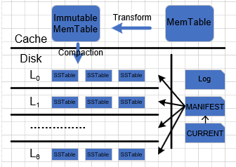
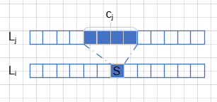

# Motivation

目标：**基于Flash的LevelDB，在不影响原有写性能的基础上优化读放大问题**。

## Read Amplification in LSM-tree

【图1：LevelDB结构】

用LevelDB来解释LSM-tree中的读放大问题，在LevelDB查找一个Key的步骤可以分为在内存查找和在外存查找两步：

1. 在内存中，首先查找MemTable，若没有找到；检查Immutable MemTable是否存在，若存在，在Immutable MemTable中查找。

2. 若在内存中均未找到，则在外存中查找。根据内存中所存储的所有SSTable的Meta信息$file\_[i][j]$，确定Key可能所在的SSTable。
   1. 第0层因为SSTable是直接从Immutable MemTable复制过来的，其中的SSTable之间的键值表示范围可能存在Overlap，所以待查找的Key可能存在于多个SSTable中，只能依次遍历每个SSTable的Meta信息，判断待查找的Key是否在第$j$个SSTable的范围内，即$file\_[0][j].smallest\le Key\le file\_[0][j].largest$ 。
   2. 第1层到第6层，因为SSTable都是通过Compaction得到的，Compaction的时候会对多个SSTable进行多路归并，SSTable之间的键值表示范围不会存在Overlap，所以待查找的Key至多只存在一个SSTable中，可以根据Meta信息中的最大键值做二分查找，最终确定可能的SSTable。

   当确定了Key可能存在的SSTable时，可以通过至多3次IO读写确定Key是否真正存在在SSTable中，及其对应的Value。

   1. 读取BloomFilter Block，根据BloomFilter确定Key是否存在，若存在则进行下一步，否则检查下一个可能的SSTable。
   2. 读取IndexBlock，确定Key所在的DataBlock的索引。
   3. 读取Key所在DataBlock，查找Key对应的Value。若不存在Key，则检查下一个可能的SSTable，否则结束查找，返回对应的Value。

从上述的查找流程发现，原本查找Key所在的一个SSTable，却因为LSM-tree的构造多读了好几个SSTable，才能找到待查找的Key真正所在的位置。根据统计可以知道，基于LSM-tree的DB的读放大平均达到了<u>？</u>倍，其中LevelDB高达<u>？</u>倍。造成读放大的原因是因为Compaction机制的引入，将数据逐渐向高层流动。当查找一个真正存在于高层的Key时，可能每一层都会有一个SSTable的范围包括了这个Key，那么在每一层都需要去检查一下这个Key是否存在在那个SSTable中。

为了解决这个读放大的问题，我们认为数据的流动方向不应该只是从$L_0$到$L_6$的，同时也应该可以从$L_6$流向$L_0$，LSM-tree中的数据应该是随着数据的访问频率而动态分布的。当高层数据最近频繁被访问时，应该将高层数据向低层流动，从而提高读性能。同时，因为原来一次的Compaction的overhead是十分巨大的，所以高层数据向低层流动时不应该再引入较大的overhead。

# Solutions

## 二级缓存替换MemTable，多Immutable MemTable

在原有的机制中，MemTable在满了以后就直接转换成Immutable MemTable，随后等待DUMP到$L_0$中。而此时在MemTable中频繁访问的数据，将会直接随着原有机制一直DUMP到$L_0$中，当再读这些数据时，都需要进行至少一次IO读写。基于此，我们提出用LRU2Q来替换MemTable，当数据从2Q淘汰后，再将其加入Immutable Memtable。

【图2：内存结构】

LRU2Q由两个队列构成，一个是基于LRU的队列，另一个是FIFO队列。新数据都被直接插入LRU队列；当数据在两个队列中被访问到时，将数据移动到LRU队列的头部；当数据被LRU队列淘汰时，将按照FIFO的规则插入FIFO队列的头部；当数据被FIFO队列淘汰后，则意味着被2Q所淘汰。

被2Q淘汰的数据将被回收，组成n个Immutable MemTable。这n个Immutable MemTable将同时存在于内存的一个长度为$N$的LRU队列中，新创建的Immutable MemTable将直接插入到LRU队列的头部；当其中某个Immutable MemTable中的Key被访问后，将这个Immutable MemTable移动到LRU队列的头部；当某个Immutable MemTable被这个LRU队列淘汰后，将它DUMP到$L_0$层中。

假设内存大小为$M$，LRU2Q中每个队列占的大小分别为$M_1, M_2$，每个Immutable MemTable的大小是$M_{IM}$，那么需要满足：
$$
M_1 + M_2 + N\times M_{IM} \le M\quad (1)
$$
一般假设每个Immutable MemTable的大小为固定大小，设定为2MB，$N$个Immutable MemTable中包括一个缓存接受LRU2Q淘汰数据的Immutable MemTable。LRU2Q的两个队列的大小相同，即$M_1= M_2$。按一定比例分配内存空间，将$M\times \alpha$的内存空间分配给LRU2Q，$M\times(1-\alpha)$的内存空间分配给Immutable MemTable List。若分配给Immutable MemTable的内存空间不足2MB，则至少分配一个Immutable MemTable，剩下均分配给LRU2Q。

## 数据上浮，使用CuckooFilter替换BloomFilter

### 为什么数据要上浮？

### 数据如何上浮？

存储的数据虽然基于LSM-tree结构，是按层次存储的，但是从存储设备的角度来看，并不存在层次结构，每层的数据在存储设备中都是平等的。导致这种层次结构的主要原因是在于内存中的基于LSM-tree的索引结构，所以若想要将数据从高层次流动到低层次，例如从$L_5$层移动到$L_3$层，只需要修改内存中的索引结构，而不需要修改存储设备中存储的数据。

用$file\_[i]$来存储$L_i$中所有SSTable文件的Meta信息，它是一个变长数组，$file\_[i][j]$表示$L_i$第$j$个文件的Meta信息，那么若想要将第5层的第4个文件移动到第3层，则只需要$file\_[3].push\_back(file\_[5][4])$。

但是基于LSM-tree结构的LevelDB满足以下两个特性：

1. 除了$L_0$层以外，其他层中的SSTable之间的键值范围不存在Overlap。$L_0$层的数据是直接从内存DUMP下来的，若要保持不存在Overlap的特性，则DUMP的同时还需要进行多路归并，代价太大了，所以允许$L_0$层中的SSTable之间的键值范围存在Overlap，但$L_0$层至多只有4个SSTable，保证了查找时的依次遍历不会产生太大的代价。其他层的文件都是通过Compaction得到的，所以可以保证不存在Overlap，文件数量也可以成倍增长，查找时可以通过二分查找加快查找效率。
2. 数据从$L_0$层到$L_6$层的新鲜度逐渐降低。换句话说就是$i$越小的$L_i$层的文件中的数据越新，若某个Key同时存在于多个SSTable中，则$i$最小的层中的Key对应的是最新的数据，其他层的数据均已无效。特别地，对$L_0$层来说，因为允许不同的SSTable之间的键值范围存在Overlap，所以越靠前即$j$越小的SSTable中的数据越新。

当将某个SSTable文件从高层流到到底层时，可能会破坏以上提到的两种特性。为了保持以上两种特性，我们提出了相应的解决方案。

### 上浮后存在Overlap

### 上浮后去除旧数据

某个文件需要上浮肯定是因为它拥有了低层所不拥有的数据，并且该数据在最近一段时间的访问频率十分高。文件上浮后，为了避免在读取该文件中的其他数据时，读取到旧数据，所以需要上浮的过程去除该文件中的旧数据。

一个简单的想法就是利用和Compaction一样的方法，对上浮的文件同样做Compaction操作。但是Compaction操作所带来的代价太大了，需要进行大量的IO读写操作，这不是我们所期待的。通过观察查找Key的步骤发现，查找一个Key之前，LevelDB为了提高查找效率都会先读取BloomFilter的数据，根据BloomFilter判断该Key是否存在于该SSTable中，再进行更细粒度的查找。

BloomFilter可以看作整个SSTable的一个snapshot，删除数据时若只删除BloomFilter中的数据，而不删除原有数据block中的数据，将会大大减少上浮产生的代价。考虑到BloomFilter无法进行删除操作，同时还存在一定的错误率，我们将使用更高效，空间利用率更高，且无错误率的CuckooFilter来替换BloomFilter。

#### 维护每个文件最近访问次数

#### 确定上浮层数

【图3：公式图】

对于$L_i$层的文件S，将它移动到$L_j$层：

设常量$F$为迄今为止最近的$F$次访问，$f$为迄今为止的最近$F$次访问中文件S被访问的次数，$T_R,T_W$分别表示Flash读一个页和写一个页的时间消耗，不妨假设未来的$F$次访问中，文件S也将会被访问$f$次，同时文件S不会被Compaction，那么

* 不移动文件S，这$f$次访问所带来的时间消耗为：$T_1=f\times 3\times T_R\times (4 + i)$
* 将文件S移动到$L_j$层，这$f$次访问所带来的时间消耗为：$T_2=f\times 3\times T_R \times (4 + j) + T_W+T_R\times \sum^j_{k=i-1}c_k$，其中$c_k$表示$L_k$层与文件S的键值范围有Overlap的文件个数。

定义$T_{diff}=T_1-T_2$表示移动后相比移动前，能够减少的时间消耗，若为负数，则表示增加时间消耗，那么：
$$
T_{diff}=f\times 3\times T_R\times (4 + i) - 3\times T_R\times (4 +j) - T_W - T_R \times \sum^j_{k=i-1}c_k
\\
T_{diff} = f\times 3\times T_R\times (i - j) - T_W-T_R\times \sum^j_{k=i-1}c_k \quad(2)
$$
因为$T_W\approx 4\times T_R$，所以公式（2）可以转换为
$$
T_{diff}=f\times 3\times (i-j)-4 - \sum^j_{k=i-1}c_k\quad(3)
$$
其中$0\le j\le i-1$。

因为$i$不超过6，那么依次枚举每个$j$，找到最大的$T_{diff}$，将文件S移动到$L_j$层。

# 问题

1. 如何维护最近F次访问中，每个文件被访问的次数？

   对于每个文件都记录最近$F$次的访问次数$f$。

   对于较小的$F$，用一个FIFO队列来维护最近的$F$次访问的文件序号。当从队列中弹出一个文件序号$p$时，将对应文件序号的文件的访问次数减一；当加入一个文件序号$p$时，将对应文件序号的文件的访问次数加一。

   对于较大的$F$，将最近的$F$次访问中间部分的文件序号存储在外存，仅仅在内存维护2个最大大小为$F^{'}$的FIFO队列，一个是存储最近的$F$次访问头部的文件序号的队列$Q_{head}$，另一个是存储最近的$F$次访问尾部的文件序号的队列$Q_{tail}$。当需要删除一个文件序号$p$时，从$Q_{head}$弹出这个文件序号，将对应文件序号的文件的访问次数减一；当需要添加一个文件序号$p$时，加入$Q_{tail}$，将对应文件序号的文件的访问次数加一。当$Q_{head}$为空时，将$Q_{tail}$写入外存，清空队列$Q_{tail}$；再从外存中读入前$F^{'}$个文件序号，依次加入$Q_{head}$。

| 序号 | 顺序读（scan） | 随机读（read） | 插入（insert） | 更新（update） | 类型                                     |
| ---- | -------------- | :------------- | :------------- | :------------- | ---------------------------------------- |
| 1    | 45%            | 45%            | 5%             | 5%             | 读多写少、顺序读和随机读一样             |
| 2    | 85%            | 5%             | 5%             | 5%             | 读多写少、顺序读多                       |
| 3    | 5%             | 85%            | 5%             | 5%             | 读多写少、随机读多                       |
| 4    | 23%            | 22%            | 45%            | 5%             | 读写一样、顺序读和随机读一样、写新数据多 |
| 5    | 45%            | 5%             | 45%            | 5%             | 读写一样、顺序读多、写新数据多           |
| 6    | 5%             | 45%            | 45%            | 5%             | 读写一样、随机读多、写新数据多           |
| 7    | 22%            | 23%            | 5%             | 45%            | 读写一样、顺序读和随机读一样、更新数据多 |
| 8    | 45%            | 5%             | 5%             | 45%            | 读写一样、顺序读多、更新数据多           |
| 9    | 5%             | 45%            | 5%             | 45%            | 读写一样、随机读多、更新数据多           |
| 10   | 2%             | 3%             | 90%            | 5%             | 读少写多、写新数据多                     |
| 11   | 2%             | 3%             | 5%             | 90%            | 读少写多、更新数据多                     |
| 12   | 2%             | 3%             | 47%            | 48%            | 读少写多、写新数据和更新数据一样         |

