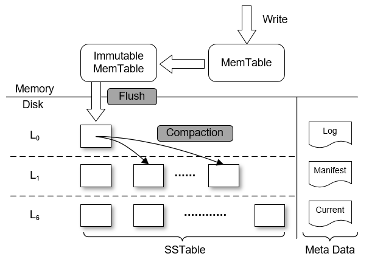
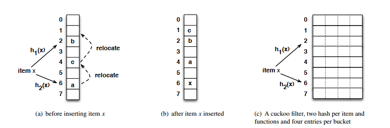
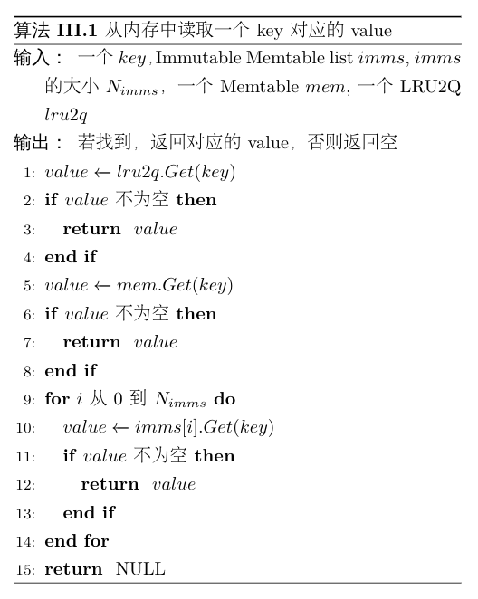

# Background

## LevelDB

### 简介

LevelDB is a fast key-value storage library written at Google that provides an ordered mapping from string keys to string values【LevelDB】.LevelDB is an open source key-value store that originated
from Google’s BigTable 【Bigtable】它具有很高的随机写（45.0MB/s）、顺序写（62.7MB/s和顺序读性能（232.2MB/s），但随机读性能一般【LevelDB - Performance】。LevelDB在外存存储时使用了LSM-Tree【LSM-tree】的结构，对索引变更进行延迟及批量处理，并通过多路归并的方法高效的将数据更新迁移到磁盘，降低索引插入的开销。

### 结构

【图1：LevelDB结构】

图1是LevelDB的整体结构。

The main data structures in LevelDB are an on-disk log file, two in-memory sorted skiplists (memtable and immutable memtable), and seven levels ($L_0$ to $L_6$) of on-disk Sorted String Table (SSTable) files.【WiscKey】

LevelDB initially stores inserted key-value pairs in a log file and the in-memory memtable. Once the memtable is full, LevelDB switches to a new memtable and log file to handle further inserts from the user; in the background, the previous memtable is converted into an immutable memtable, and a compaction thread then flushes it to disk, generating a new SSTable file at level 0 ($L_0$) with a rough size of 2MB; the previous log file is subsequently discarded. 【WiscKey】

当MemTable写满后，LevelDB将它被转换成一个不可写的Immutable MemTable，等待着被移动到外存，并创建一个新的空的MemTable接受新的输入。【https://github.com/google/leveldb/blob/master/doc/impl.md （Level 0）】

SSTable是LevelDB在外存中主要的数据组织形式，每个SSTable文件可以划分成4个区域：数据块区域，索引块区域，Meta块区域，footer块区域。数据块区域由许多数据块构成，每个数据块包含许多个键值对数据。索引块区域包含一个索引块，它存储了每个数据块的最大值、在文件中的偏移量等相关信息，偏于快速定位到数据所在的数据块。Meta块区域可以用于对LevelDB进行功能扩展，如添加过滤器以加速查找过程。footer块区域存储了每个区域在SSTable文件中的相应位置。【https://github.com/google/leveldb/blob/master/doc/table_format.md】

The youngest level, Level 0, is produced by writing the Immutable MemTable from main memory to the disk. 【LOCS】When the size of level L exceeds its limit, we compact it in a background thread. The compaction picks a file from level L and all overlapping files from the next level L+1. Note that if a level-L file overlaps only part of a level-(L+1) file, the entire file at level-(L+1) is used as an input to the compaction and will be discarded after the compaction. Aside: because level-0 is special (files in it may overlap each other), we treat compactions from level-0 to level-1 specially: a level-0 compaction may pick more than one level-0 file in case some of these files overlap each other.【https://github.com/google/leveldb/blob/master/doc/impl.md（Compactions）】

Thus SSTables in Level 0 could contain overlapping keys. However, in other levels the key range of SSTables are non-overlapping. Each level has a limit on the maximum number of SSTables, or equivalently, on the total amount of data because each SSTable has a fixed size in a level. The limit grows at an exponential rate with the level number. For example, the maximum amount of data in Level 1 will not exceed 10 MB, and it will not exceed 100 MB for Level 2. 【LOCS】

## CuckooFilter介绍及结合

BloomFilter具有以下两点不足：

1. 具有一定的错误率。将不存在的元素返回存在。
2. 无法删除元素。

也有很多对BloomFilter的改进：

* 引入计数。extend Bloom filters to allow deletions. A counting Bloom filter uses an array of counters in place of an array of bits. 【摘自CuckooFilter中对Counting BloomFilter的引用】
* 分成小块。do not support deletion, but provide better spatial locality on lookups. A blocked Bloom filter
  consists of an array of small Bloom filters, each fitting in one CPU cache line. 【摘自CuckooFilter中对Blocked BloomFilter的引用】
* Hash tables using d-left hashing [19] store fingerprints for stored items. These filters delete items by removing their fingerprint.  【摘自CuckooFilter中对d-left Counting BloomFilter的引用】

### CuckooFilter的介绍

Cuckoo filters support adding and removing items dynamically while achieving even higher performance than Bloom filters. 【CuckooFilter】

【图2：用于理解CuckooFilter，不使用该图】

CuckooFilter使用的Hash方法是CuckooHash【CuckooHash】，A basic cuckoo hash table consists of an array of buckets where each item has two candidate buckets determined by hash functions h1(x) and
h2(x).  【CuckooFilter】

A basic cuckoo hash table consists of an array of buckets where each item has two candidate buckets determined by hash functions h1(x) and h2(x).  If either of x’s two buckets is empty, the algorithm inserts x to that free bucket and the insertion completes. If neither bucket has space, as is the case in this example, the item selects one of the candidate buckets, kicks out the existing item (in this case “a”) and re-inserts this victim item to its own alternate location. 【CuckooFilter】The lookup of the element can be performed using the same two hash values.  【PA CuckooFilter】

### CuckooFilter的结合

用CuckooFilter来表示一个SSTable中都包含哪些Key。当因为Overlap而要删除SSTable中的某些Key时，仅仅删除CuckooFilter中的Key，而不重新组织DataBlock。

具体见：外存：数据上浮，替换Filter --> 1. 数据如何上浮？ --> 具体操作

## Flash

Flash是一种长寿命的非易失性（在断电情况下仍能保持所存储的数据信息）的存储器。普通的Flash芯片是平面结构，数据只能前后左右移动。

3D NAND Flash通过堆叠栅极层的结构提高了比特密度，可以实现数据在三维空间中的存储和传递，大幅提高了存储设备的存储能力。3D NAND Flash基本存储单元是Page , 擦除操作的基本单位是块。每一Page的有效容量是512字节的倍数。由于每个块的擦除时间几乎相同，块的容量将直接决定擦除性能。

# Motivation

目标：**基于Flash的LevelDB，在不影响原有写性能的基础上优化读放大问题**。

## LevelDB查找过程

在LevelDB查找一个Key的步骤主要可以分为**在内存查找**和**在外存查找**两步：

1. 在内存中，首先在MemTable中查找，若没有找到，则检查Immutable MemTable是否存在。若存在，在Immutable MemTable中查找。
2. 若在内存中均未找到，则在外存中查找。因为数据存在于外存中的SSTable文件中，所以首先要确定数据所在的SSTable文件，其次再从对应的SSTable文件中读取具体的数据。
   1. 内存中维护了所有SSTable的Meta信息，包括SSTable的最小值、最大值等。除$L_0$层外，其他层均可以通过二分查找确定Key可能存在的SSTable。$L_0$层因为存在Overlap，所以只能依次遍历判断。
   2. 确定了Key可能存在的SSTable时，需要读取SSTable文件来判断Key是否真正存在于这个SSTable中，这个步骤可以通过至多3次IO读写来实现。
      1. 读取BloomFilter Block，根据BloomFilter确定Key是否存在，若存在则进行下一步，否则检查下一个可能的SSTable。
      2. 读取IndexBlock，确定Key所在的DataBlock的索引。
      3. 读取Key所在DataBlock，查找Key对应的Value。若不存在Key，则检查下一个可能的SSTable，否则结束查找，返回对应的Value。

从上述的查找流程发现，原本查找Key所在的一个SSTable，却因为特殊的索引结构多读了好几个SSTable，才能找到待查找的Key真正所在的位置。根据统计可以知道，基于LevelDB的读放大平均达到了<u>？</u>倍。造成读放大的原因是因为Compaction机制的引入，将数据逐渐向低层流动。当查找一个真正存在于低层的Key时，因为可能每一层都会有一个SSTable的范围包括了这个Key，所以在每一层都需要进行至多3次IO去检查一下这个Key是否存在在那层的SSTable中。

为了解决这个读放大的问题，我们认为数据的流动方向不应该只是从$L_0$到$L_6$的，同时也应该可以**从$L_6$流向$L_0$，**同时外存中的数据不应该仅仅按照新旧程度从上至下分布，还应该**随着数据的访问频率而动态分布**。当低层数据最近频繁被访问时，应该将其向高层流动，从而提高读性能。同时，因为原来一次的Compaction的overhead是十分巨大的，所以**数据上浮时不应该再引入较大的overhead**。

# Algorithm

major contribution：

1. 重新设计了内存的存储结构；
2. 用CuckooFilter替换BloomFilter；
3. 增加了数据上浮的操作；

## 内存：多级缓存替换

### 结构

【图2：内存存储结构】

我们提出的内存存储结构中，用LRU2Q替换原有的MemTable，同时维护一个由多个更小的Immutable Memtable组成的Imm LRU。用一个更小的MemTable作为缓冲，每当有数据从LRU2Q中淘汰时，数据将会被加入MemTable。当MemTable满了以后，将其加入Imm List。当Imm LRU满了之后，将该LRU队尾的Immutable MemTable淘汰，DUMP到外部存储设备中。

### 与LevelDB比较

1. 在原有的内存存储结构中，**在MemTable中频繁访问的数据，会因为新数据的加入而被转换成Immutable MemTable，随后DUMP到$L_0$中。当再读这些数据时，都需要进行IO读写。**我们所提出的结构能够让频繁访问的数据长时间被保存在内存中，而不会因为机制的问题而被强制DUMP到外部存储设备中。
2. 同时，在原有的结构中，每当一个Immutable MemTable被DUMP到外部存储设备时，都会创建一个新的空的MemTable，并且因为一个MemTable的大小较大，所以此时内存的利用率会出现较大程度的下降。我们所提出的结构采用更小的MemTable和Immutable MemTable作为一个分配单位，不会较大程度的下降，基本上维持在较高的水准。

### 例子

【图3：例子】

如图3，内存中已经存入了`a,b,c,d,e,f,g,h,i`，如子图1。在原来的结构中，Immutable MemTable中保存了`e,f,g,h,i`，MemTable中保存了`a,b,c,d`，还留有一个空位置；在我们提出的结构中，LRU2Q中，LRU队列保存了`a,b`，FIFO队列保存了`c,d`。MemTable中仅保存了`e`，也还留有一个空位置。Imm LRU中包含了两个Immutable MemTable，分别存储了`f,g`和`h,i`。两种结构中的内存利用率均为90%。

如子图2，当读了`d`和`h`之后，原来的结构中与子图1中没有发生任何变化。而在我们提出的结构中，因为`d`存储在LRU2Q中的FIFO队列，所以被访问了以后，被挪动到LRU队列的头部，并将队尾的`b`踢到FIFO队列中。因为`h`存储在Imm LRU的第二个Immutable中，所以访问了之后，将这个Immutable移动到Imm LRU的头部。需要注意的是，Imm LRU只是为了Immutable MemTable的DUMP而设计，而实际在访问的过程时，仍然按照加入Imm LRU的先后顺序访问，以保证数据的新旧程度。

如子图3，当写入`j`后，原来的结构中的MemTable达到饱和状态。在我们提出的结构中，`j`被加入LRU2Q的LRU队列头部，并将`a`踢入FIFO队列，`c`被LRU2Q淘汰，加入MemTable。此时两种结构的内存利用率均达到最大值100%。

如子图4，当写入`k`后，原来的结构因为MemTable已经饱和，所以将Immutable MemTable DUMP到外部存储设备，并将原来的MemTable转化为Immutable MemTable，创建一个新的MemTable用于接收`k`。而在我们的结构中，`k`被加入LRU2Q的LRU队列头部，并将`d`踢入FIFO队列，`b`被LRU2Q队列淘汰。因为此时MemTable已经饱和，则将其加入Imm LRU。同时，因为Imm LRU中Immutable MemTable的数量达到最大值，需要将队尾的包含`f,g`的Immutable MemTable DUMP到外部存储设备。之后再将MemTable转化为Immutable MemTable，加入Imm LRU的头部。最后创建新的MemTable，接收被LRU2Q淘汰的`b`。此时，原来结构中的内存利用率达到最小值60%，而我们的结构中仍然保持在90%。

如子图5，当读取`i`和`e`时，在原有的结构中，因为`i,e`之前存在于同一个Immutable MemTable此时已经被DUMP到外部存储设备，所以现在需要从外部存储设备通过IO读取数据。在我们提出的结构中，因为`e`和`i`仍处于内存中，所以读取的速度更快。

### 大小分析

内存空间最少需要保证一个MemTable和一个Immutable Memtable（默认均2MB）。

若内存不足4MB，则按平均分一半划分为MemTable，一半划分为Immutable MemTable。

当内存大于4MB，优先增加LRU2Q的大小。当LRU2Q的大小为所有MemTable和Immutable MemTable的2倍时，增加一个Immutable MemTable。当Immutable MemTable数量达到设定上限（默认为4）时，剩下的内存均分配给LRU2Q。

### 伪代码

**Algorithm 1 内存数据读取**

算法3.1展示在新的内存结构中如何查询一个key对应的value的过程。首先在LRU2Q中通过$Get(key)$方法查询对应的value，若找到，则直接返回结果。若未找到，在缓冲的immutable Memtable中通过$Get(key)$方法查找。同样的，若找到，则直接返回结果。若未找到，在immutable MemTable的LRU2Q队列中，从队首到队尾，依次在每个immutable MemTable中查找，若找到，则直接返回结果，否则继续查找。若在内存中，都未找到，则返回NULL。

**Algorithm 2 内存存储数据**

算法3.2展示在新的内存结构中如何存储一对key和value。首先在LRU2Q中通过$Put(key, value)$的方法将key和value存储在LRU2Q的中LRU队列的队首，若$key$已经存在了，则直接更新$value$。同时，该方法还会返回从LRU2Q中淘汰的数据$d\_key, d\_value$。若有数据被淘汰，则需要将其加入到缓冲的Immutable MemTable$imm\_temp\_$中。若$imm\_temp\_$已经满了，则将它加入到immutable MemTable的LRU队列$imms\_$的头部，重新分配一个新的Immutable MemTable。同时，若$imms\_$已经满了，则淘汰队尾的Immutable MemTable，用指针$imm\_dump\_$指向淘汰的Immutable MemTable，将其返回，等待DUMP到$L_0$层。

## 外存：数据上浮，替换Filter

### 结构

【图4：外部存储结构】

如图4，我们为每层额外增加了一个list用于存放被上浮的文件。

如图4（1），当$L_5$层中的一个文件被访问后，通过计算得出将其移动到$L_1$层。为了不引起Overlap，将其先放在$L_1$层的额外的list中，随后在$L_1$层进行Compaction的时候将其合并到file中。

如图4（2），当$L_5​$层额外的list中的一个文件被访问后，同样的通过计算将其移动到$L_0​$层，等待合并。

### 需要解决的问题

1. 数据如何上浮？
2. 数据上浮的层数？
3. 哪些数据需要上浮？

#### 1. 数据如何上浮？

##### 两个性质

1. **除了$L_0$层以外，其他层中的SSTable之间的键值范围不存在Overlap**。对于$L_0$层来说，数据是直接从内存DUMP下来的，若要保持不存在Overlap的特性，在DUMP的同时还需要进行多路归并，但是考虑到IO读写的代价对性能的影响，所以允许Immutable MemTable直接生成SSTable，直接DUMP到$L_0$层，其该层的SSTable之间的键值范围存在Overlap。$L_0$层至多只有4个SSTable，这也相对有了一定的折中，保证了查找效率。其他层的文件都是通过Compaction得到的，所以可以保证不存在Overlap，文件数量也可以成倍增长，查找时可以通过二分查找加快查找效率。
2. **数据从$L_0$层到$L_6$层的新旧度逐渐降低，** $i$越小的$L_i$层的文件中的数据越新。若某个Key同时存在于多层的多个SSTable中，则$i$最小的层中的Key对应的是最新的数据，其他层的数据均已无效。特别地，对$L_0$层来说，因为允许不同的SSTable之间的键值范围存在Overlap，所以越靠前即$j$越小的SSTable中的数据越新。

##### 为什么要换成CuckooFilter

文件M需要上浮的主要原因是它拥有了高层所不拥有的数据，并且该数据在最近一段时间的访问频率十分高。文件上浮后，为了避免在读取该文件中的其他数据时，读取到旧数据，所以需要上浮的过程去除该文件中的旧数据。

可以发现，在查找一个Key之前，LevelDB为了提高查找效率，对每个SSTable增加了一个Filter，用于快速判断一个Key是否存在在当前的SSTable中。因为Filter所能表示的Key的个数和实际SSTable的Key的个数是一样的，那么**可以把Filter看作整个SSTable的一个snapshot**。在去除旧数据时若能够只删除Filter中的数据，而不删除DataBlock中的数据，将会大大减少上浮产生的代价。**若DataBlock中某个Key是旧数据，那么上浮完成后在对应的Filter中这个Key已经被删除了，在Filter中就永远不会被查询到，就不会进一步查询DataBlock**。

LevelDB中引入的是BloomFilter，但它具有以下几点不足：

1. 存在一定的错误率，将不存在的Key可能会返回存在。
2. 无法进行删除操作。

我们将文件上浮以后，需要继续保持原有的两个性质，我们使用查询效率更高，空间利用率更高，且无错误率的CuckooFilter[CuckooFilter]来替换BloomFilter。

##### 具体操作

对于$L_i$层的文件M，用集合$S_M$表示文件M对应的CuckooFilter。设$L_{j}$层有$k$个文件与文件M表示的键值范围有交集，他们对应的CuckooFilter分别为$S^u_1,\ldots,S^u_k$，那么将文件M移动到$L_{j}$层后，它的CuckooFilter变为$S_M=S_M-S^u_t\quad \{u=i-1,\ldots,j,t=1,\ldots,k\}$。若一个SSTable至多有$n$个KV数据，那么该操作的时间复杂度为$O((i-j)\cdot k\cdot n)$ 。根据实验数据分析可以看出，$k$的值不超过5[LOCS]，$i-j$的大小也不会超过6，每上升一层，CuckooFilter中存储的Key的个数$n$只会逐渐减少。

#### 2. 数据上浮的层数？

对于$L_i$层的文件M，将它移动到$L_j$层：

设$T_R,T_W$分别表示Flash读一个页和写一个页的时间消耗。假设未来的$F$次访问中，文件M也将会被访问$f_{i,M}$次，同时文件M不会被Compaction，那么考虑移动与不移动分别产生的代价：

- 不移动文件M：这$f_{i,M}$次访问所带来的时间消耗为：$T_1=f_{i,M}\times 3\times T_R\times (3 + i + i\times LIST\_MAX\_NUM)$。最坏情况下，在每一层（除$L_0$层外）的`file_`部分都需要查询一个文件，共计$i-1$个文件，$L_0$层每个文件都需要查询，共4个文件；每一层的`list_`部分的每个文件都需要查询，根据预设每层至多有$LIST\_MAX\_NUM$个文件存储在$list\_$中，所以总共有$4 + i-1 + i\times LIST\_MAX\_NUM$个文件需要查询，对于每个文件都需要进行3次IO读（读取FilterBlock，读取IndexBlock，读取DataBlock）。
- 将文件M移动到$L_j$层，这$f_{i,M}$次访问所带来的时间消耗为：$T_2=f_{i,M}\times 3\times T_R \times (3+ j  + j\times LIST\_MAX\_NUM) + T_W+T_R\times( \sum^j_{k=i-1}c_k+1)$，其中$c_k$表示$L_k$层与文件M的键值范围有Overlap的文件个数。最坏情况下，$T_2$的前半部分为移动到$L_j$层后的查询文件$M$的代价，$T_W$为写入新的Filter的代价，$T_R\times (\sum^j_{k=i-1}c_k+1)$为读取文件$M$及从$L_{i-1}$层到$L_j$层与文件$M$存在Overlap的文件的Filter的代价。

定义$T_{diff}=T_1-T_2$表示移动后相比移动前，能够减少的时间代价，若为负数，则表示增加时间代价，那么：
$$
T_{diff}=T_1-T_2=f_{i,M}\times 3\times T_R\times (3 + i + i\times LIST\_MAX\_NUM) \\- f_{i,M}\times 3\times T_R \times (3 + j + j\times LIST\_MAX\_NUM) \\- T_W -T_R\times( \sum^j_{k=i-1}c_k+1)
\\
T_{diff} = f_{i,M}\times 3\times T_R \times (i-j)\times(LIST\_MAX\_NUM + 1)\\-T_W-T_R\times( \sum^j_{k=i-1}c_k+1) \quad(3)
$$
因为$T_W\approx \alpha\times T_R$，所以公式（3）可以转换为
$$
T_{diff}=f_{I,m}\times 3\times (i-j)\times(LIST\_MAX\_NUM+1)- \sum^j_{k=i-1}c_k-1-\alpha \quad(4)
$$
其中$0\le j\le i-1$，$LIST\_MAX\_NUM$不超过10。

因为$i$不超过6，那么依次枚举每个$j$，找到最大的$T_{diff}$，将文件M移动到$L_j$层。 

#### 3. 哪些数据需要上浮？

在外部存储器中，数据从高层到低层是按照新旧度依次递减的，$L_0$层的数据最新， $L_6$层的数据最旧。根据前文所叙述的访问机制来看，相比于高层的SSTable，查找低层的SSTable会消耗更多的时间。当一个低层的SSTable近期被频繁访问时，所产生的代价是很大的，因此我们认为**数据分布不仅仅需要考虑数据的新旧度，同时还需要考虑数据的访问频率**。当低层的某个SSTable的访问频率越来越高时，这个SSTable应该通过适当的调整，上浮到高层。

我们对每个SSTable文件记录最近$F$次访问中的访问次数$f$，第$i$层的第$j$个SSTable的最近$F$次访问中的访问次数为$f_{i,j}$，若满足
$$
f_{i,j}\ge min(f_{i-1,k})  \times \beta (i > 0)\quad (2)
$$
其中$f_{i-1,k}$为第$i-1$层的第$k$个SSTable的最近$F$次访问中的访问次数，$\beta$为常数，那么这个SSTable文件需要进行上浮操作。

### 例子

### 算法

#### 上浮后去除旧数据

**Algorithm 3 维护最近$F$次访问频率**

算法3.3 展示了如何维护最近$F$次访问的文件序号。若$F$较小，则等价于将所有的文件序号放在一个FIFO中。若$F$较大，则在内存中维护2个FIFO，分别表示原来的一个FIFO的头部和尾部。删除数据时从头部FIFO$visit\_[0]$头部删除，添加数据时从尾部FIFO$visit\_[1]$尾部添加。

**Algorithm 4 上浮求CuckooFilter差积**

# Trace

| 序号 | 随机读（read） | 更新（update） | 顺序读（scan） | 插入（insert） | 类型                                     |
| ---- | -------------- | -------------- | -------------- | :------------- | ---------------------------------------- |
| 1    | 0.48           | 0.03           | 0.47           | 0.02           | 读多写少、顺序读和随机读一样             |
| 2    | 0.05           | 0.03           | 0.90           | 0.02           | 读多写少、顺序读多                       |
| 3    | 0.90           | 0.03           | 0.05           | 0.02           | 读多写少、随机读多                       |
| 4    | 0.25           | 0.05           | 0.25           | 0.45           | 读写一样、顺序读和随机读一样、写新数据多 |
| 5    | 0.05           | 0.05           | 0.45           | 0.45           | 读写一样、顺序读多、写新数据多           |
| 6    | 0.45           | 0.05           | 0.05           | 0.45           | 读写一样、随机读多、写新数据多           |
| 7    | 0.25           | 0.45           | 0.25           | 0.05           | 读写一样、顺序读和随机读一样、更新数据多 |
| 8    | 0.05           | 0.45           | 0.45           | 0.05           | 读写一样、顺序读多、更新数据多           |
| 9    | 0.45           | 0.45           | 0.05           | 0.05           | 读写一样、随机读多、更新数据多           |
| 10   | 0.03           | 0.05           | 0.02           | 0.90           | 读少写多、写新数据多                     |
| 11   | 0.03           | 0.90           | 0.02           | 0.05           | 读少写多、更新数据多                     |
| 12   | 0.03           | 0.48           | 0.02           | 0.47           | 读少写多、写新数据和更新数据一样         |

# REF

[LSM-tree]：The Log-Structured Merge-Tree

[GoogleWeb]：https://github.com/google/leveldb

[BloomFilter]：

[CuckooFilter]：Cuckoo FIlter：Practically Better Than Bloom

[LOCS]：An Efficient Design and Implementation of LSM-Tree based Key-Value Store on Open-Channel SSD 

[BigTable]：F. Chang, J. Dean, S. Ghemawat, W. C. Hsieh, D. A. Wallach, M. Burrows, T. Chandra, A. Fikes, and R. E. Gruber. Bigtable: A distributed storage system for structured data. ACM Trans. Comput. Syst., 26(2):4:1–4:26, June 2008 

[WiscKey]：

[PA CuckooFilter]：Minseok Kwon, Vijay Shankar, Pedro Reviriego:Position-aware cuckoo filters. ANCS 2018: 151-153

[Counting BloomFilter]：L. Fan, P. Cao, J. Almeida, and A. Z. Broder. Summary cache: A scalable wide-area Web cache sharing protocol. In Proc. ACM SIGCOMM, Vancouver, BC, Canada, Sept. 1998. 

[Blocked BloomFilter]：F. Putze, P. Sanders, and S. Johannes. Cache-, hash- and spaceefficient bloom filters. In Experimental Algorithms, pages 108–121. Springer Berlin / Heidelberg, 2007. 

[d-left Counting BloomFilter]：F. Bonomi, M. Mitzenmacher, R. Panigrahy, S. Singh, and
G. Varghese. An improved construction for counting bloom filters. In 14th Annual European Symposium on Algorithms, LNCS 4168, pages 684–695, 2006. 

[CuckooHash]：R. Pagh and F. Rodler. Cuckoo hashing. Journal of Algorithms,51(2):122–144, May 2004. 